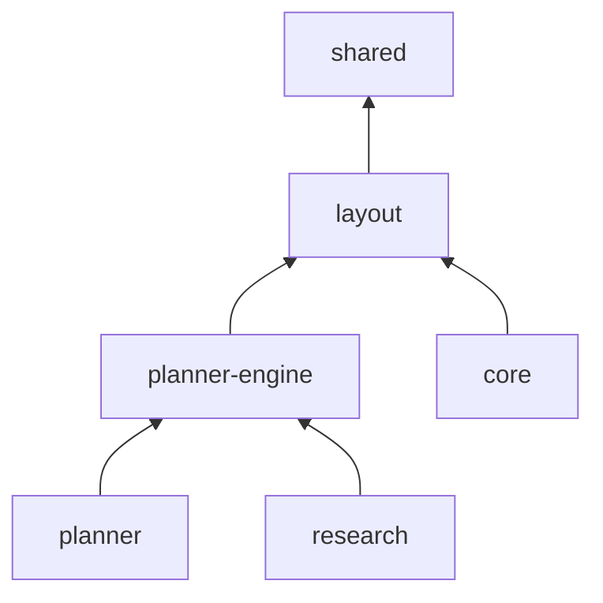

# wms — программный модуль управления заданиями и маршрутизацией

Gradle multi-project. Основа — §12.1 [спецификации](../Спецификация%20по%20диплому.md). Граница между сервисами проведена **по профилю нагрузки и модели состояния**, а не по предметным сущностям (§12.2). Где структура отличается от §12.1, это описано в разделе «Отступления от спецификации» ниже.

## Модули

| Модуль | Вид | Содержимое |
| --- | --- | --- |
| [`shared/`](shared) | Библиотека | Value-типы, DTO, контракты API: код ячейки, QR-нагрузка |
| [`layout/`](layout) | Библиотека | Планировка → ячейки → граф; валидация, классификатор топологии, мастер типовой планировки |
| [`planner-engine/`](planner-engine) | Библиотека | Матрица расстояний, интерфейсы стратегий, все алгоритмы планирования |
| [`planner/`](planner) | Spring Boot, stateless | REST §12.4 поверх `planner-engine`; CPU-bound, масштабируется горизонтально |
| [`core/`](core) | Spring Boot, stateful | Учёт, конструктор, задания, документы; владеет PostgreSQL |
| [`research/`](research) | CLI | Генераторы, симулятор, прогоны серий, JMH |
| [`analysis/`](analysis) | Python, вне системы | Статистика и графики по CSV-выгрузке |
| [`web/`](web) | React | Конструктор 2D, сцена 3D, монитор |
| [`terminal/`](terminal) | PWA | Терминал сборщика |



Развёртываются два сервиса, `core` и `planner`, как в §12.2. Библиотеки на граф развёртывания не влияют.

## Состояние

| Часть | Готово | Дальше |
| --- | --- | --- |
| `shared` | Код ячейки с контрольным символом, QR-нагрузка | Контракт планировщика §12.4 |
| `layout` | Модель планировки, генерация ячеек с координатами и вместимостью | Граф, валидация, классификатор, мастер |
| `core` | Весь учётный путь: приёмка → размещение → заказ → резерв → задание → терминал → отгрузка; пользователи и роли, аудит, OpenAPI | Печатные формы, слоттинг, монитор по WebSocket, вызов планировщика |
| `planner-engine`, `planner`, `research` | Каркас | Алгоритмы §9, стенд экспериментов |
| `web`, `terminal` | — | Конструктор, 3D-сцена, PWA-терминал |

## Отступления от спецификации

**1. Библиотеки `layout` и `planner-engine` (§12.1 называет четыре модуля).** Граф склада нужен трём потребителям: конструктору в `core` (валидация связности, FR-M15-07), планировщику и стенду `research`, у которого нет БД. Вариант «граф строит `planner`, а `core` зовёт его по REST» делает конструктор зависимым от доступности планировщика, хотя NFR-R-05 требует обратного. Вариант «`research` зависит от `planner`» тянет в стенд Spring Boot и Tomcat, а JMH начинает мерить окружение вместо алгоритма. Поэтому вычисления вынесены в чистые библиотеки, а сервисы стали тонкими обёртками. Граница `core` / `planner` из §12.2 при этом не меняется.

**2. Адрес ячейки строится от номера ряда, а не прохода (§11.3).** Формат `WH1-R03-12-4-2-K`: склад, ряд, секция, ярус, позиция, контрольный символ. Проход выводится из геометрии (§8.7, Б1) и меняется при переносе ряда, а адрес на наклеенной этикетке меняться не должен (§8.7, В2). Номер ряда присваивается при создании и неизменен. Контрольный символ считается по Luhn mod 36 и обязателен: при ручном вводе он ловит любую одиночную опечатку.

**3. Java 25 и Spring Boot 4.1 вместо Java 21 и Boot 3.x (§12.6).** Обе версии актуальны на момент начала реализации, ветка 3.x больше не развивается. Всё, чем §12.6 обосновывает Java 21 (records, sealed-интерфейсы, сопоставление с образцом, виртуальные потоки), в Java 25 есть.

**4. Пакет `slotting` в `planner-engine`.** См. [`planner-engine/README.md`](planner-engine/README.md).

## Раскладка функциональных модулей M1–M15

| M | Модуль спецификации | Где реализуется |
| --- | --- | --- |
| M1 | Топология склада и адресное хранение | [`core.topology`](core/src/main/java/io/github/r0mbaa/wms/core/topology), генерация ячеек и кодов — [`layout`](layout) |
| M2 | Номенклатура | [`core.catalog`](core/src/main/java/io/github/r0mbaa/wms/core/catalog) |
| M3 | Приёмка и размещение | [`core.receiving`](core/src/main/java/io/github/r0mbaa/wms/core/receiving) |
| M4 | Остатки, движения, инвентаризация | [`core.inventory`](core/src/main/java/io/github/r0mbaa/wms/core/inventory) |
| M5 | Заказы и волны | [`core.order`](core/src/main/java/io/github/r0mbaa/wms/core/order) |
| M6 | Аллокация и резервирование | [`core.allocation`](core/src/main/java/io/github/r0mbaa/wms/core/allocation) + [`engine.allocation`](planner-engine/src/main/java/io/github/r0mbaa/wms/engine/allocation) |
| M7 | Батчинг | [`engine.batching`](planner-engine/src/main/java/io/github/r0mbaa/wms/engine/batching) |
| M8 | Маршрутизация | [`engine.routing`](planner-engine/src/main/java/io/github/r0mbaa/wms/engine/routing) + [`engine.distance`](planner-engine/src/main/java/io/github/r0mbaa/wms/engine/distance) |
| M9 | Диспетчеризация заданий | [`core.task`](core/src/main/java/io/github/r0mbaa/wms/core/task) + [`engine.dispatch`](planner-engine/src/main/java/io/github/r0mbaa/wms/engine/dispatch) |
| M10 | Мобильный терминал сборщика | серверная часть — [`core.task`](core/src/main/java/io/github/r0mbaa/wms/core/task), клиент — [`terminal/`](terminal) |
| M11 | Отгрузка и документы | [`core.shipping`](core/src/main/java/io/github/r0mbaa/wms/core/shipping) |
| M12 | Слоттинг и аналитика (ML) | [`engine.slotting`](planner-engine/src/main/java/io/github/r0mbaa/wms/engine/slotting) |
| M13 | Администрирование | [`core.admin`](core/src/main/java/io/github/r0mbaa/wms/core/admin) |
| M14 | Имитационный стенд и эксперименты | [`research/`](research) |
| M15 | Конструктор склада и 3D | [`core.layout`](core/src/main/java/io/github/r0mbaa/wms/core/layout) + [`layout`](layout) + [`web/`](web) |

**M6 и M9 намеренно разрезаны между сервисами.** Состояние (записи резервов, записи заданий) принадлежит `core`, алгоритм выбора — планировщику. Это прямое следствие границы из §12.2: она проведена по профилю нагрузки, поэтому предметный модуль может её пересекать.

README пакетов лежат рядом с кодом, в `src/main/java/io/github/r0mbaa/wms/<модуль>/<пакет>/`.

## Сборка

Нужен JDK 25. Если его нет, Gradle скачает его сам через toolchain. Отдельно ставить Gradle не нужно, в репозитории есть wrapper.

```sh
cd wms
./gradlew build            # Windows: gradlew.bat build — компиляция и все тесты
./gradlew :core:bootRun    # учётное ядро на :8080, /actuator/health
./gradlew :planner:bootRun # планировщик на :8081
```

Запуск учётного ядра, переменные окружения и первый вход описаны в [`core/README.md`](core/README.md). Сборку и тесты при каждом пуше выполняет GitHub Actions ([`.github/workflows/build.yml`](../.github/workflows/build.yml)).

Для `core` нужен запущенный Docker. Интеграционные тесты поднимают PostgreSQL 16 через Testcontainers, а `bootRun` сам запускает его из [`docker-compose.yml`](docker-compose.yml). Встраиваемая БД не подходит, потому что инварианты учёта держатся на CHECK-ограничениях, триггерах и блокировках строк PostgreSQL (§12.2).

Версии зависимостей зафиксированы в [`gradle/libs.versions.toml`](gradle/libs.versions.toml), общие настройки Java-модулей — в [`build-logic`](build-logic/src/main/kotlin/wms.java-conventions.gradle.kts).
