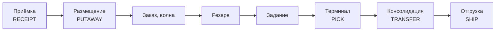

# core — учётное ядро

Spring Boot, Java 25. Stateful: владеет PostgreSQL. Профиль — I/O-bound, короткие транзакции.

Отказ `core` останавливает работу склада, поэтому после стабилизации код здесь меняется редко (§12.2).

Геометрию (ячейки, граф, валидацию планировки) `core` не вычисляет сам, а получает из библиотеки [`layout`](../layout).

| Пакет | Модуль §7 | Требования |
| --- | --- | --- |
| [`admin/`](src/main/java/io/github/r0mbaa/wms/core/admin) | M13 Пользователи, роли, JWT, аудит | FR-M13-01 .. 05 |
| [`topology/`](src/main/java/io/github/r0mbaa/wms/core/topology) | M1 Склады, зоны, места хранения | FR-M1-01 .. 14 |
| [`layout/`](src/main/java/io/github/r0mbaa/wms/core/layout) | M15 Версии планировки, перенос ячеек в учёт | FR-M15-01 .. 31 |
| [`catalog/`](src/main/java/io/github/r0mbaa/wms/core/catalog) | M2 Номенклатура | FR-M2-01 .. 06 |
| [`inventory/`](src/main/java/io/github/r0mbaa/wms/core/inventory) | M4 Остатки и журнал движений | FR-M4-01 .. 10 |
| [`receiving/`](src/main/java/io/github/r0mbaa/wms/core/receiving) | M3 Приёмка и размещение | FR-M3-01 .. 07 |
| [`order/`](src/main/java/io/github/r0mbaa/wms/core/order) | M5 Заказы и волны | FR-M5-01 .. 08 |
| [`allocation/`](src/main/java/io/github/r0mbaa/wms/core/allocation) | M6 Резервирование | FR-M6-01 .. 06 |
| [`task/`](src/main/java/io/github/r0mbaa/wms/core/task) | M9, M10 Тара, сборщики, задания, терминал | FR-M9-01 .. 09, FR-M10-01 .. 12 |
| [`shipping/`](src/main/java/io/github/r0mbaa/wms/core/shipping) | M11 Консолидация и отгрузка | FR-M11-01 .. 07 |
| [`common/`](src/main/java/io/github/r0mbaa/wms/core/common) | — | Формат ошибок, страницы списков, часы, расписание, OpenAPI |

В каждом пакете есть README: что реализовано, какие решения приняты и что отложено.

## Сквозной путь



Каждое изменение остатка — движение в неизменяемом журнале, проведённое через `StockLedger` в одной транзакции с изменением строк остатка. Поэтому остаток всегда восстановим из журнала, и это проверяется запросом (INV-04).

Алгоритмы планирования (аллокация по стратегиям, батчинг, маршрутизация, диспетчеризация) — в планировщике. В `core` для каждого шага есть простой резервный режим, который работает без него (NFR-R-05): правило «минимум ячеек», ручное формирование задания с обходом по адресам, выдача заданий по раннему дедлайну.

## Транзакционная целостность

Основную работу выполняет СУБД, фреймворк только управляет границами транзакций (§12.2):

| Что | Механизм |
| --- | --- |
| Нет отрицательных остатков и резерва больше остатка (INV-01, INV-02) | `CHECK` на `stock` |
| Журнал движений неизменяем (NFR-R-04) | Триггер `BEFORE UPDATE OR DELETE` |
| Конкурентная аллокация заказа (FR-M6-05, NFR-R-02) | `@Version` и повтор транзакции при конфликте |
| Атомарное резервирование волны | `PESSIMISTIC_WRITE` на строках остатка в порядке id места и SKU |
| Перемещения не блокируют друг друга взаимно | Фиксированный порядок захвата: ячейка, зона, строки остатка |
| Идемпотентность событий терминала (NFR-R-03) | `INSERT … ON CONFLICT DO NOTHING` по ключу события |
| Одновременная выдача заданий двум сборщикам | `FOR UPDATE SKIP LOCKED` |
| Сверки INV-03, INV-04, INV-09 | Запросы `/api/v1/allocations/integrity`, `/inventory/integrity`, `/shipping/integrity` |

## Запуск

```sh
cd wms
WMS_ADMIN_PASSWORD=<пароль> ./gradlew :core:bootRun
```

`bootRun` сам поднимает PostgreSQL из `docker-compose.yml`, Flyway накатывает схему, а на пустой БД создаётся пользователь `admin` с этим паролем. Вход — `POST /api/v1/auth/login`. Описание API — `/swagger-ui.html` (OpenAPI 3.1, NFR-M-07).

| Переменная | Назначение |
| --- | --- |
| `WMS_ADMIN_PASSWORD` | Пароль первого администратора; без неё пользователь не создаётся |
| `WMS_JWT_SECRET` | Ключ подписи JWT, Base64 от 32 байт; без него ключ случайный на каждый запуск |
| `WMS_DB_URL`, `WMS_DB_USER`, `WMS_DB_PASSWORD` | Подключение к PostgreSQL вне `bootRun` |

**Порт по умолчанию:** 8080.

## Тесты

Интеграционные, на PostgreSQL 16 в Testcontainers: инварианты держатся на `CHECK`, триггерах и блокировках строк, и встраиваемая БД их не проверит. Все тестовые классы делят один контекст и один контейнер, таблицы очищаются перед каждым тестом. Кроме API проверяются конкурентные сценарии: перемещения из одной ячейки, аллокации на один остаток и одновременная выдача заданий.
