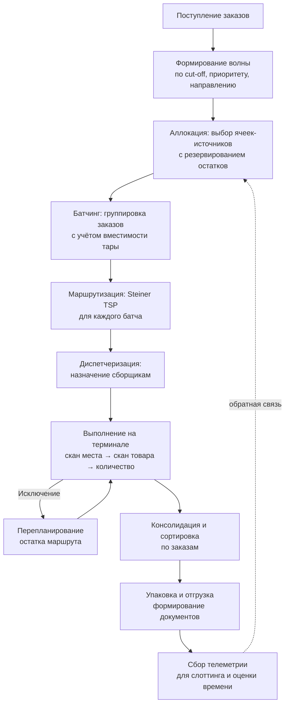

# Программный модуль интеллектуального управления заданиями и маршрутизацией для складского предприятия

**Спецификация системы**
Версия 0.1 (черновик для ВКР бакалавра, направление «Программная инженерия»)

---

## 1. Краткое описание

### 1.1. Ёмкая формулировка

> Веб-система управления складом с адресным хранением на QR-кодах. Свой QR-код имеет каждая полка стеллажа и каждый вид товара. Размещение выполняется двумя сканированиями с телефона прямо в браузере: сотрудник сканирует товар, затем полку и указывает количество, после чего товар появляется в системе на этом месте с записью в истории перемещений. При поступлении заказов на отгрузку система объединяет их в партии сборки с учётом вместимости тары и строит для каждой оптимальный маршрут обхода склада. Сборщик получает маршрутный лист на телефон и идёт по нему, сканируя только товары: подтверждённые позиции автоматически уходят с полок в тару, а после подтверждения отгрузки списываются со склада с формированием документов. Планировка склада создаётся в редакторе на виде сверху; маршруты, размещение товаров и результаты сравнения алгоритмов отображаются на карте — плоской на телефоне и трёхмерной схематичной на компьютере, где видно, на каком ярусе стеллажа находится каждая точка отбора.

### 1.2. Формулировка в одно предложение (для аннотации)

Программный модуль, автоматизирующий цикл «приход товара → размещение по QR → заказ → оптимальный маршрут сборки → отгрузка» за счёт совместного решения четырёх оптимизационных задач (аллокация, батчинг, маршрутизация, диспетчеризация) на графовой модели склада, с конструктором планировки и трёхмерной визуализацией маршрутов.

### 1.3. Ключевая идея, отличающая работу от «просто WMS»

Учётная часть (места, номенклатура, остатки, документы) является **инфраструктурой**, а не предметом исследования. Предмет исследования — **сменный слой алгоритмов планирования** с единым контрактом, эталонной точной реализацией для измерения качества и стендом экспериментов, позволяющим воспроизводимо сравнить методы между собой.

### 1.4. Принятые ключевые решения

| Решение | Выбор | Краткое обоснование |
|---|---|---|
| **Баланс работы** | 50% инженерия / 50% исследование | Требует жёсткого урезания объёма (§3.2); полный сквозной сценарий сохраняется, глубина второстепенных модулей сокращается |
| **Стек** | Java 21 + Spring Boot, Gradle-монорепозиторий, два сервиса `core` и `planner`; Python только для статистического анализа результатов вне системы | Определяющий фактор — владение технологией: соло-разработчик в жёстком сроке реализует систему в знакомом стеке быстрее и надёжнее. Алгоритмическая часть закрывается JGraphT, OR-Tools и SPMF; JMH и jqwik дают более строгие бенчмарки и тесты, чем аналоги. Граница с Python проходит по CSV-файлам, а не по API, поэтому не создаёт интеграционных издержек (§12.2) |
| **Данные** | Реальный спрос + синтетическая топология | Состав заказов берётся из открытого датасета (структура корзины, распределение популярности SKU, совместная встречаемость), планировка склада генерируется параметрически. Реальное предприятие подключается позже через адаптер импорта без изменения архитектуры (§14.3) |
| **ML-компонент** | Обучение без учителя на реальных корзинах | Супервизорные модели на симулированных данных восстанавливают формулу симулятора, а не закономерность реального мира (§10.4) |

### 1.5. Критические технические условия

Условия, невыполнение которых делает неработоспособной ключевую функциональность. Проверяются в начале работы, а не перед сдачей.

> **HTTPS обязателен для сканирования.** Браузер предоставляет доступ к камере (`navigator.mediaDevices.getUserMedia`) только в защищённом контексте: по HTTPS либо на `localhost`. Веб-приложение, открытое с телефона по локальному IP через `http://`, камеру не получит, и сканирование QR — центральная операция всей системы — работать не будет.
>
> Следствия:
> - Среда разработки и демонстрации разворачивается сразу с TLS: самоподписанный сертификат с доверием на устройстве, локальный удостоверяющий центр (`mkcert`) либо туннель, выдающий валидный сертификат.
> - Проверка выполняется **с реального телефона, а не с настольного браузера**: на `localhost` разработчика ограничение не проявляется и создаёт ложное ощущение работоспособности.
> - Контрольная точка назначена на этап, где появляется терминал (§15.4), но настроить TLS дешевле сразу при создании каркаса проекта.
> - Требование зафиксировано как NFR-SEC-05 и NFR-SEC-07, риск учтён в §16, предусловие демонстрации — в §15.5.

Прочие условия того же класса: точка отбора соответствует колонке стеллажа, а не отдельной ячейке (§8.1); измерение времени алгоритмов выполняется через JMH с прогревом JVM (§12.6); все стохастические алгоритмы и генераторы принимают seed (NFR-E-01).

**Цель.** Разработать программный модуль, снижающий трудозатраты на комплектацию заказов на складе за счёт интеллектуального планирования заданий и маршрутов сборки.

**Задачи:**

1. Провести анализ предметной области и обзор методов Picker Routing Problem и Order Batching Problem.
2. Формализовать модель склада как взвешенного графа и поставить задачи аллокации, батчинга, маршрутизации и диспетчеризации.
3. Спроектировать архитектуру системы с подключаемым слоем алгоритмов планирования.
4. Реализовать базовые эвристики, точный алгоритм для частного случая топологии и метаэвристики.
5. Реализовать учётное ядро (адресное хранение, приёмка, остатки, отгрузка, документы) и мобильный терминал сборщика.
6. Разработать имитационный стенд: генератор топологий, генератор потока заказов, дискретно-событийная модель сборки.
7. Провести вычислительный эксперимент, сравнить методы по набору метрик, оценить отклонение от оптимума.
8. Оценить экономический эффект и сформулировать рекомендации по применимости методов.

---

## 3. Границы системы

### 3.1. Входит в объём работы

- **Конструктор планировки склада** на плане с параметризацией стеллажей.
- **Трёхмерная схематичная визуализация** склада, размещения товаров и маршрутов.
- Адресное хранение, топология склада, коды мест и QR-маркировка.
- Приёмка, размещение, внутренние перемещения, списание, инвентаризация.
- Учёт остатков в разрезе ячеек с резервированием.
- Приём заказов на отгрузку, формирование волн.
- Планирование: аллокация → батчинг → маршрутизация → диспетчеризация.
- Мобильный терминал сборщика (PWA) с подтверждением по сканированию.
- Обработка исключений при сборке с перепланированием.
- Формирование печатных документов.
- Аналитика и рекомендации по слоттингу.
- Имитационный стенд и модуль сравнения алгоритмов.

**Ключевое ограничение конструктора.** Редактирование планировки выполняется **только в двумерном виде сверху**. Третье измерение является производным: высота стеллажа вычисляется из числа ярусов и высоты яруса, заданных параметрами. Трёхмерное представление — это **режим отображения одной и той же модели, а не второй редактор**. Обоснование в §7.15.1.

### 3.2. Не входит (осознанные ограничения)

**Вне предметной области:**

- Интеграция с бухгалтерскими системами (1С, SAP) — предусмотрен только формат экспорта.
- Управление транспортом, доставкой, маршрутизацией автомобилей (VRP).
- Автоматизированные склады, конвейеры, AS/RS, роботизированные системы (AGV/AMR).
- Ценообразование, взаиморасчёты, договорная работа.
- Мультискладские сети и межскладские перемещения.
- Мобильное нативное приложение (используется PWA).

**Урезано в связи с балансом 50/50** (требования сохранены в спецификации со статусом `W`, но не реализуются):

| Что исключается | Экономия | Почему безболезненно |
|---|---|---|
| Прогноз спроса для упреждающего слоттинга | ~1,5 нед | Дублирует по смыслу ABC/XYZ; на синтетическом горизонте не проверяется |
| Партионный учёт, сроки годности, FEFO | ~1 нед | Поля в модели данных заложены, логика не влияет на предмет исследования |
| Кросс-докинг | ~0,5 нед | Не затрагивает ни одну из четырёх оптимизационных задач |
| Полноценная инвентаризация с циклическим планом | ~1 нед | Оставляется ручная корректировка остатка с актом |
| Offline-режим терминала | ~1 нед | Технически сложен, на защите не даёт ничего сверх онлайн-режима |
| Схема склада на терминале сборщика | ~0,5 нед | Схема с маршрутом остаётся в веб-панели, где она и нужна для демонстрации |
| SA и GA для маршрутизации | ~1 нед | Достаточно ACO (заявлен в теме) и 2-opt (практичный) |
| Контрольная проверка заказа при упаковке | ~0,5 нед | Отгрузка выполняется по факту сборки |

**Итого высвобождается около 7 недель**, что и позволяет довести обе половины работы до защищаемого состояния.

**Что не урезается ни при каких условиях:**

1. Сквозной сценарий от приёмки до отгрузки (без него нет демонстрации системы).
2. Точный алгоритм маршрутизации как эталон (без него нет измерения качества).
3. Стенд экспериментов (без него нет исследовательской главы).
4. Реестр стратегий (без него нет инженерного вклада).

### 3.3. Допущения предметной области

- Склад с ручной покомплектной сборкой (manual picker-to-parts). Сборщик перемещается пешком с тележкой.
- Топология: параллельные проходы, поперечные проходы (cross-aisles), зона отгрузки как депо. Поддерживается однозонная и многозонная прямоугольная планировка; общий случай задаётся произвольным графом.
- Стратегия сборки: pick-by-order и pick-by-batch (sort-while-pick). Зонная сборка (pick-and-pass) — в перспективе.
- Один депо-узел (точка старта и финиша маршрута). Несколько депо — в перспективе.

---

## 4. Глоссарий

| Термин | Определение |
|---|---|
| **Ячейка (Location)** | Минимальная адресуемая единица хранения. Определяется кодом и координатами. |
| **Адрес** | Иерархический код ячейки: склад → зона → ряд → стеллаж → ярус → ячейка. |
| **SKU** | Единица товарной номенклатуры. Уникальна для вида товара (не для экземпляра). |
| **Остаток (Stock)** | Количество конкретного SKU в конкретной ячейке. |
| **Резерв** | Часть остатка, закреплённая за конкретным заказом и недоступная другим. |
| **Движение (Movement)** | Неизменяемая запись об изменении остатка (приход, размещение, перемещение, отбор, списание, корректировка). |
| **Заказ (Order)** | Запрос на отгрузку: набор строк (SKU, количество), приоритет, дедлайн. |
| **Волна (Wave)** | Группа заказов, планируемых совместно, объединённая по времени отгрузки, перевозчику или направлению. |
| **Батч (Batch)** | Набор заказов, собираемых за один проход по складу. |
| **Задание (Task)** | Батч, назначенный конкретному сборщику, с построенным маршрутом. |
| **Точка отбора (Pick point)** | Проекция ячейки на ось прохода — узел графа, куда физически подходит сборщик. |
| **Депо** | Узел старта и финиша маршрута (зона отгрузки / буферная зона). |
| **Маршрутный лист** | Упорядоченный список точек отбора задания. |
| **Слоттинг** | Определение оптимального места хранения SKU. |
| **Cut-off** | Крайний срок завершения сборки заказа для попадания в отгрузку. |

---

## 5. Роли пользователей

| Роль | Основные функции |
|---|---|
| **Кладовщик приёмки** | Приёмка товара, генерация задания на размещение, подтверждение размещения. |
| **Сборщик (комплектовщик)** | Получение задания на терминал, обход маршрута, сканирование, регистрация исключений. |
| **Диспетчер / начальник смены** | Мониторинг очереди заданий, формирование волн, ручное переназначение, приоритизация, разбор исключений. |
| **Оператор отгрузки** | Проверка собранных заказов, упаковка, формирование отгрузочных документов. |
| **Администратор склада** | Ведение топологии, номенклатуры, параметров планировщика, применение рекомендаций по слоттингу. |
| **Аналитик / исследователь** | Запуск экспериментов, сравнение алгоритмов, просмотр отчётов (роль обеспечивает исследовательскую часть ВКР). |
| **Системный администратор** | Пользователи, роли, интеграции, резервное копирование, мониторинг. |

---

## 6. Основные бизнес-процессы

### 6.1. Сквозной поток



### 6.2. Приёмка и размещение

1. Регистрация прихода (номер поставки, поставщик, ожидаемые позиции).
2. Приёмка по факту: сканирование штрихкода SKU, ввод количества, регистрация расхождений.
3. Товар попадает в виртуальную зону приёмки.
4. Система предлагает ячейки для размещения (по правилу слоттинга: ABC-класс, габариты, совместимость, близость к депо).
5. Кладовщик получает задание на размещение, сканирует ячейку назначения и SKU, подтверждает.
6. Формируется движение типа `PUTAWAY`, остаток переходит из зоны приёмки в ячейку.

### 6.3. Сборка заказа

1. Сборщик берёт тележку, сканирует её код (тележка определяет вместимость и число ячеек-контейнеров).
2. Система выдаёт назначенное задание с упорядоченным списком точек.
3. На каждой точке сборщик сканирует **только QR товара**; система сверяет SKU с ожидаемым для шага, принимает количество и переносит позицию с полки на виртуальную ячейку тары. Скан QR полки запрашивается лишь тогда, когда SKU доступен более чем в одной ячейке зоны отбора.
4. При невозможности отбора регистрируется исключение с типом (нет товара, повреждён, недостаточно, недоступна ячейка).
5. После последней точки сборщик возвращается в депо и сдаёт тележку на консолидацию; окончательное списание со склада происходит при подтверждении отгрузки.

### 6.4. Обработка исключений

| Тип исключения | Реакция системы |
|---|---|
| Недостаточное количество | Отбирается фактическое, остаток строки переаллоцируется в другую ячейку, точка вставляется в остаток маршрута (дешёвая вставка) |
| Товар отсутствует | Создаётся задача на инвентаризацию ячейки, строка переаллоцируется или заказ переводится в «частично собран» |
| Товар повреждён | Регистрируется списание, строка переаллоцируется |
| Ячейка недоступна | Точка помечается пропущенной, маршрут перестраивается на оставшихся точках |
| Обнаружен пересорт | Создаётся задача на инвентаризацию, блокируется ячейка |

---

## 7. Функциональные требования

Обозначения приоритета: **M** — обязательно (MVP), **S** — желательно, **C** — возможно, **W** — перспектива.

### 7.1. M1. Топология склада и адресное хранение

| ID | Требование | Прио |
|---|---|---|
| FR-M1-01 | Система должна позволять создавать склад с параметрами: наименование, единицы измерения расстояний, скорость перемещения по умолчанию. | M |
| FR-M1-02 | Система должна поддерживать иерархию: склад → зона → ряд → стеллаж → ярус → ячейка. | M |
| FR-M1-03 | Каждая ячейка должна иметь уникальный человекочитаемый код по настраиваемому шаблону (например, `WH1-A03-12-04-2`). | M |
| FR-M1-04 | Каждая ячейка должна иметь метрические координаты `(x, y, z)` в системе координат склада. | M |
| FR-M1-05 | Ячейка должна иметь тип: отбор, навал (bulk), приёмка, отгрузка, буфер, брак, карантин. | M |
| FR-M1-06 | Ячейка должна иметь ограничения: максимальный вес, максимальный объём, допустимые классы хранения. | M |
| FR-M1-07 | Система должна строить граф склада: узлы точек отбора, узлы пересечений проходов, узел депо; рёбра с длиной в метрах. | M |
| FR-M1-08 | Система должна поддерживать импорт топологии из CSV/JSON и параметрический генератор прямоугольной планировки (число проходов, число стеллажей, число ярусов, ширина прохода, число поперечных проходов). | M |
| FR-M1-09 | Система должна визуализировать план склада в виде схемы с возможностью наложения маршрута. | S |
| FR-M1-10 | Система должна учитывать вертикальное перемещение: штраф времени за отбор с яруса выше/ниже «золотой зоны». | S |
| FR-M1-11 | Система должна поддерживать блокировку ячейки (недоступна для отбора и размещения) с указанием причины. | M |
| FR-M1-12 | Система должна генерировать QR-коды для ячеек пакетно, с выгрузкой в PDF для печати этикеток. | M |
| FR-M1-13 | Система должна поддерживать редактирование топологии с версионированием (изменение планировки не должно ломать историю). | C |
| FR-M1-14 | Система должна поддерживать произвольные (непрямоугольные) планировки через прямое задание графа. | S |

### 7.2. M2. Номенклатура

| ID | Требование | Прио |
|---|---|---|
| FR-M2-01 | Система должна вести справочник SKU с уникальным идентификатором и артикулом. | M |
| FR-M2-02 | SKU должен содержать: наименование, штрихкод(ы), базовую единицу измерения, габариты (Д×Ш×В), вес, объём. | M |
| FR-M2-03 | Система должна поддерживать несколько штрихкодов на один SKU (EAN-13, Code128, внутренний). | S |
| FR-M2-04 | SKU должен иметь класс хранения (обычный, хрупкий, тяжёлый, крупногабаритный) для проверки совместимости с ячейкой. | S |
| FR-M2-05 | Система должна автоматически рассчитывать и хранить ABC-класс по частоте отбора и XYZ-класс по стабильности спроса. | S |
| FR-M2-06 | Система должна поддерживать альтернативные единицы измерения с коэффициентами пересчёта (штука/коробка/паллета). | C |

### 7.3. M3. Приёмка и размещение

| ID | Требование | Прио |
|---|---|---|
| FR-M3-01 | Система должна регистрировать документ прихода с перечнем ожидаемых позиций. | M |
| FR-M3-02 | Система должна фиксировать фактически принятое количество и расхождения с ожидаемым. | M |
| FR-M3-03 | Система должна формировать задание на размещение с рекомендованными ячейками. | M |
| FR-M3-04 | Алгоритм рекомендации ячейки должен учитывать: ABC-класс SKU, расстояние до депо, свободный объём и вес ячейки, совместимость классов хранения, наличие того же SKU в ячейке (консолидация). | M |
| FR-M3-05 | Кладовщик должен иметь возможность разместить товар в ячейку, отличную от рекомендованной, с фиксацией отклонения. | M |
| FR-M3-06 | Размещение должно подтверждаться последовательностью: скан QR товара → скан QR полки → ввод количества. Порядок сканирования фиксирован, обратный порядок система принимает, но с явным указанием распознанной сущности. | M |
| FR-M3-06a | Поскольку QR товара кодирует вид (SKU), а не экземпляр, количество вводится вручную и не выводится из числа сканирований. | M |
| FR-M3-07 | Система должна поддерживать кросс-докинг: направление принятого товара сразу в отгрузку под открытый заказ. | W |

### 7.4. M4. Остатки, движения, инвентаризация

| ID | Требование | Прио |
|---|---|---|
| FR-M4-01 | Система должна хранить остаток в разрезе (ячейка, SKU) с полями `quantity` и `reserved_quantity`. | M |
| FR-M4-02 | Доступное количество вычисляется как `quantity − reserved_quantity` и не может быть отрицательным. | M |
| FR-M4-03 | Любое изменение остатка должно порождать неизменяемую запись движения с полями: тип, SKU, количество, ячейка-источник, ячейка-приёмник, пользователь, время, ссылка на документ-основание. | M |
| FR-M4-04 | Система должна поддерживать типы движений: `RECEIPT`, `PUTAWAY`, `TRANSFER`, `PICK`, `SHIP`, `ADJUSTMENT`, `WRITE_OFF`, `RETURN`. | M |
| FR-M4-05 | Система должна отображать полную историю перемещений SKU и историю операций по ячейке. | M |
| FR-M4-06 | Текущий остаток должен быть восстановим воспроизведением журнала движений (проверка целостности). | S |
| FR-M4-07 | Система должна поддерживать выборочную инвентаризацию: формирование задания на пересчёт ячеек, ввод факта, формирование акта расхождений. | S |
| FR-M4-08 | Система должна формировать циклическую инвентаризацию по правилу: ячейки A-класса чаще, C-класса реже. | C |
| FR-M4-09 | Система должна поддерживать внутренние перемещения (пополнение зоны отбора из зоны навала). | S |
| FR-M4-10 | Система должна поддерживать партионный учёт (номер партии, срок годности) и отбор по FEFO. | W |

### 7.5. M5. Заказы и волны

| ID | Требование | Прио |
|---|---|---|
| FR-M5-01 | Система должна принимать заказ на отгрузку: номер, контрагент, строки (SKU, количество), приоритет, дедлайн отгрузки, направление/перевозчик. | M |
| FR-M5-02 | Система должна поддерживать приём заказов через REST API и через ручной ввод/импорт CSV. | M |
| FR-M5-03 | Система должна поддерживать статусную модель заказа: `NEW → ALLOCATED → PLANNED → IN_PROGRESS → PICKED → PACKED → SHIPPED`, а также `PARTIALLY_PICKED`, `CANCELLED`. | M |
| FR-M5-04 | Система должна проверять обеспеченность заказа остатками и помечать необеспеченные строки. | M |
| FR-M5-05 | Система должна формировать волну по критериям: дедлайн, перевозчик, направление, приоритет, максимальный размер волны. | M |
| FR-M5-06 | Волна должна формироваться автоматически по расписанию (за N минут до cut-off) и вручную диспетчером. | S |
| FR-M5-07 | Система должна поддерживать отмену заказа с освобождением резервов на любом этапе до отбора. | M |
| FR-M5-08 | Система должна поддерживать срочный заказ (hot order), обрабатываемый вне волны. | S |

### 7.6. M6. Аллокация и резервирование

| ID | Требование | Прио |
|---|---|---|
| FR-M6-01 | Для каждой строки заказа система должна определить набор источников: пары (ячейка, количество), суммарно покрывающие потребность. | M |
| FR-M6-02 | Аллокация должна поддерживать подключаемые стратегии: ближайшая к депо ячейка, ячейка с минимальным остатком (для освобождения мест), минимизация числа затрагиваемых ячеек, FEFO. | M |
| FR-M6-02a | Политика хранения задаётся на уровне зоны: «выделенное место» (один SKU — одна ячейка отбора) или «свободное размещение» (несколько ячеек). Политика определяет, требуется ли скан полки при отборе (FR-M10-04a) и является ли задача аллокации содержательной (см. комментарий к INV-08). | M |
| FR-M6-03 | При аллокации доступное количество в ячейке должно резервироваться атомарно. | M |
| FR-M6-04 | Резерв должен иметь время жизни; при отмене планирования резервы освобождаются. | M |
| FR-M6-05 | Аллокация должна выполняться в рамках транзакции с оптимистической блокировкой; параллельные аллокации не должны приводить к отрицательным остаткам. | M |
| FR-M6-06 | Аллокация должна учитывать целевую функцию маршрутизации: при прочих равных выбирается ячейка, минимизирующая прирост длины маршрута батча (совместная аллокация и маршрутизация). | S |

### 7.7. M7. Батчинг

| ID | Требование | Прио |
|---|---|---|
| FR-M7-01 | Система должна разбивать множество заказов волны на батчи с соблюдением ограничений вместимости тары. | M |
| FR-M7-02 | Ограничения вместимости: максимальный объём, максимальный вес, максимальное число заказов (число контейнеров тележки), максимальное число строк. | M |
| FR-M7-03 | Заказ не должен разбиваться между батчами в базовом режиме (order integrity constraint). | M |
| FR-M7-04 | Система должна поддерживать разбиение крупного заказа на несколько батчей, если он не помещается в тару целиком. | S |
| FR-M7-05 | Система должна поддерживать подключаемые алгоритмы батчинга (см. §9.2) с выбором из интерфейса и через конфигурацию. | M |
| FR-M7-06 | Батчинг должен учитывать дедлайны: заказ с ближайшим cut-off не должен попадать в батч, который не успевает быть выполнен. | S |
| FR-M7-07 | Система должна ограничивать время работы алгоритма батчинга конфигурируемым бюджетом (по умолчанию 5 с) и возвращать лучшее найденное решение при его исчерпании. | M |
| FR-M7-08 | Диспетчер должен иметь возможность вручную изменить состав батча до начала выполнения. | S |

### 7.8. M8. Маршрутизация

| ID | Требование | Прио |
|---|---|---|
| FR-M8-01 | Система должна строить замкнутый маршрут из депо через все точки отбора батча и обратно в депо. | M |
| FR-M8-02 | Система должна вычислять матрицу кратчайших расстояний между точками отбора (Дейкстра/Флойд–Уоршелл) и кэшировать её. | M |
| FR-M8-03 | Система должна поддерживать подключаемые алгоритмы маршрутизации (см. §9.1). | M |
| FR-M8-04 | Система должна реализовывать точный алгоритм Ratliff–Rosenthal для однозонной прямоугольной планировки как эталон качества. | M |
| FR-M8-05 | Маршрут должен разворачиваться из последовательности точек отбора в последовательность узлов исходного графа (полный путь для отображения на схеме). | M |
| FR-M8-06 | Система должна рассчитывать оценку длительности маршрута: время перемещения + время отбора на каждой точке + время подъёма/наклона по ярусу. | M |
| FR-M8-07 | Система должна поддерживать перепланирование остатка маршрута при исключении, не меняя уже пройденные точки. | M |
| FR-M8-08 | Порядок точек в маршруте должен учитывать характеристики груза: тяжёлые и крупногабаритные позиции раньше (укладка снизу). | C |
| FR-M8-09 | Система должна ограничивать время работы алгоритма маршрутизации конфигурируемым бюджетом (по умолчанию 1 с). | M |
| FR-M8-10 | Система должна учитывать односторонние проходы, если они заданы в топологии. | C |

### 7.9. M9. Диспетчеризация заданий

| ID | Требование | Прио |
|---|---|---|
| FR-M9-01 | Система должна вести реестр сборщиков со статусом (свободен, выполняет задание, перерыв, не на смене) и текущей позицией (последняя подтверждённая ячейка). | M |
| FR-M9-02 | Система должна назначать задания сборщикам, минимизируя суммарное опоздание относительно cut-off и холостой пробег. | M |
| FR-M9-03 | Система должна поддерживать подключаемые правила диспетчеризации (см. §9.3). | M |
| FR-M9-04 | Система должна учитывать зональные ограничения и квалификацию сборщика (допуск к оборудованию, к зоне). | S |
| FR-M9-05 | Диспетчер должен иметь возможность вручную переназначить задание или изменить его приоритет. | M |
| FR-M9-06 | Система должна возвращать задание в очередь при уходе сборщика со смены с сохранением прогресса. | S |
| FR-M9-07 | Система должна предоставлять диспетчеру монитор в реальном времени: очередь заданий, загрузка сборщиков, риск срыва cut-off. | S |
| FR-M9-08 | Система должна балансировать загрузку сборщиков (разброс времени выполнения между сборщиками не должен превышать заданный порог). | C |
| FR-M9-09 | Система должна учитывать заторы в проходах (не более N сборщиков в одном проходе одновременно). | W |

### 7.10. M10. Мобильный терминал сборщика

| ID | Требование | Прио |
|---|---|---|
| FR-M10-01 | Терминал должен работать как веб-приложение (PWA) в браузере телефона, без установки нативного приложения. | M |
| FR-M10-01a | Сканирование QR должно выполняться камерой телефона средствами браузера. Приложение должно обслуживаться по HTTPS, так как доступ к камере в браузере вне localhost требует защищённого соединения. | M |
| FR-M10-01b | Терминал должен поддерживать ввод с аппаратного сканера, эмулирующего клавиатуру, как альтернативу камере. | S |
| FR-M10-02 | Сборщик должен авторизоваться по PIN-коду или сканированию личного бейджа. | M |
| FR-M10-03 | Терминал должен отображать текущий шаг маршрута крупно: адрес ячейки, ярус, наименование и изображение SKU, требуемое количество, номер контейнера. | M |
| FR-M10-04 | Подтверждение шага должно требовать **сканирования только QR товара**. Система сверяет отсканированный SKU с ожидаемым для текущего шага и отклоняет несовпадение с указанием причины. | M |
| FR-M10-04a | Сканирование QR полки при отборе не требуется, но должно запрашиваться дополнительно, если ожидаемый SKU доступен более чем в одной ячейке зоны отбора (см. INV-08). | M |
| FR-M10-04b | Ручной ввод кода вместо сканирования допускается для указанных ролей и фиксируется в журнале аудита. | M |
| FR-M10-04c | Количество подтверждается вводом; по умолчанию подставляется требуемое по заданию значение. | M |
| FR-M10-05 | Терминал должен отображать прогресс задания (пройдено N из M точек) и оставшееся расчётное время. | S |
| FR-M10-06 | Терминал должен позволять зарегистрировать исключение с выбором типа и комментарием. | M |
| FR-M10-07 | Терминал должен работать в offline-режиме: маршрут кэшируется, события буферизуются и синхронизируются при восстановлении связи. | S |
| FR-M10-08 | Все события подтверждения должны содержать идемпотентный ключ, повторная отправка не должна дублировать движения. | M |
| FR-M10-09 | Интерфейс должен быть пригоден для работы одной рукой: крупные элементы управления, минимум ввода с клавиатуры. | M |
| FR-M10-10 | Терминал должен показывать плоскую карту склада с текущей точкой и следующей точкой маршрута. Трёхмерное представление на телефоне не используется. | S |
| FR-M10-11 | Подтверждение шага должно порождать движение с ячейки хранения на виртуальную ячейку тары сборщика. Окончательное списание со склада выполняется при подтверждении отгрузки. | M |
| FR-M10-12 | При отмене заказа после сборки, но до отгрузки, система должна формировать задание на возврат товара из тары в ячейку хранения. | S |

### 7.11. M11. Отгрузка и документы

| ID | Требование | Прио |
|---|---|---|
| FR-M11-01 | После завершения сборки батча система должна разложить собранное по заказам (консолидация) и сформировать задание на проверку. | M |
| FR-M11-02 | Система должна поддерживать контрольную проверку заказа сканированием перед упаковкой. | S |
| FR-M11-03 | Система должна формировать печатные формы: приходный ордер, задание на размещение, маршрутный лист, лист комплектации заказа, отгрузочную накладную, акт расхождений, акт инвентаризации. | M |
| FR-M11-04 | Документы должны выгружаться в PDF и XLSX. | M |
| FR-M11-05 | При отгрузке остатки должны списываться со склада с формированием движений `SHIP`. | M |
| FR-M11-06 | Система должна поддерживать частичную отгрузку с фиксацией недопоставленных строк. | S |
| FR-M11-07 | Система должна выгружать данные об отгрузке во внешнюю систему через API/webhook. | C |

### 7.12. M12. Слоттинг и аналитика (ML-компонент)

| ID | Требование | Прио |
|---|---|---|
| FR-M12-01 | Система должна рассчитывать ABC/XYZ-классификацию SKU по истории отборов за настраиваемый период. | M |
| FR-M12-02 | Система должна строить матрицу совместной встречаемости SKU в заказах. | S |
| FR-M12-03 | Система должна выявлять группы часто совместно заказываемых SKU (ассоциативные правила / кластеризация графа совместной встречаемости). | S |
| FR-M12-04 | Система должна формировать рекомендации по перекладке: список пар (SKU, целевая ячейка) с оценкой ожидаемого сокращения длины маршрута. | S |
| FR-M12-05 | Рекомендации должны быть ранжированы по соотношению «выигрыш / трудозатраты на перекладку». | C |
| FR-M12-06 | Администратор должен иметь возможность принять рекомендацию, что порождает задание на внутреннее перемещение. | S |
| FR-M12-07 | Система должна строить модель прогноза длительности задания по признакам (длина маршрута, число точек, число строк, число проходов, вес, число подъёмов на верхние ярусы, исполнитель) и использовать её в диспетчеризации. | S |
| FR-M12-08 | Система должна прогнозировать спрос на SKU на горизонт планирования для упреждающего слоттинга. | C |
| FR-M12-09 | Система должна отслеживать деградацию моделей и инициировать переобучение по расписанию. | C |
| FR-M12-10 | Система должна предоставлять дашборд KPI: строк в час, средняя длина маршрута на строку, доля заказов в срок, загрузка сборщиков, точность остатков. | S |

### 7.13. M13. Администрирование

| ID | Требование | Прио |
|---|---|---|
| FR-M13-01 | Система должна поддерживать аутентификацию и ролевую авторизацию (RBAC) в соответствии с §5. | M |
| FR-M13-02 | Система должна вести журнал аудита действий пользователей. | M |
| FR-M13-03 | Система должна позволять конфигурировать параметры планировщика: активные алгоритмы, их гиперпараметры, бюджеты времени, ограничения тары. | M |
| FR-M13-04 | Система должна вести справочник тары/тележек с параметрами вместимости. | M |
| FR-M13-05 | Изменение конфигурации планировщика должно версионироваться, чтобы результаты планирования были воспроизводимы. | S |

### 7.14. M14. Имитационный стенд и модуль экспериментов

> Ключевой модуль для исследовательской части ВКР.

| ID | Требование | Прио |
|---|---|---|
| FR-M14-01 | Генератор топологий должен создавать склады по параметрам: число проходов, длина прохода, число ярусов, число поперечных проходов, ширина прохода, положение депо. | M |
| FR-M14-02 | Генератор потока заказов должен создавать заказы с настраиваемым распределением числа строк, распределением популярности SKU (равномерное, ABC 20/80, Парето с параметром) и интенсивностью потока. | M |
| FR-M14-03 | Дискретно-событийная модель должна имитировать выполнение заданий: перемещение с заданной скоростью, время отбора, время подъёма, время на депо, вероятность исключений. | M |
| FR-M14-04 | Стенд должен запускать серию прогонов по сетке параметров с фиксированным seed для воспроизводимости. | M |
| FR-M14-05 | Стенд должен сравнивать комбинации «алгоритм батчинга × алгоритм маршрутизации × правило диспетчеризации» на одинаковых наборах данных. | M |
| FR-M14-06 | Стенд должен рассчитывать отклонение от оптимума там, где оптимум вычислим (точный алгоритм / решатель для малых экземпляров). | M |
| FR-M14-07 | Результаты должны выгружаться в CSV и визуализироваться (графики зависимости метрик от параметров, доверительные интервалы). | M |
| FR-M14-08 | Стенд должен уметь воспроизводить эксперимент по сохранённому конфигу одной командой. | S |
| FR-M14-09 | Источник заказов должен быть задан общим интерфейсом `OrderSource` с реализациями: синтетический генератор, загрузчик открытого датасета (UCI Online Retail, Instacart), загрузчик выгрузки реального предприятия. Замена источника не должна требовать изменений вне его реализации. | M |
| FR-M14-10 | Загрузчик открытых датасетов должен выполнять очистку (отмены, отрицательные количества, пропуски) и агрегацию транзакций в заказы, а также присвоение габаритов и веса SKU по настраиваемому правилу. | M |
| FR-M14-11 | Стенд должен поддерживать три сценария начального размещения SKU: случайное, по ABC-классам, по корреляции — для измерения вклада слоттинга отдельно от вклада алгоритмов планирования. | S |

### 7.15. M15. Конструктор склада и трёхмерная визуализация

#### 7.15.1. Принцип разделения: редактирование в 2D, отображение в 3D

Планировка редактируется на виде сверху, трёхмерная сцена генерируется из той же модели и доступна только для просмотра и навигации. Обоснование:

| Причина | Пояснение |
|---|---|
| **Сохранение класса топологии** | Эвристики S-shape, Largest Gap, Midpoint, Combined и точный алгоритм Ratliff–Rosenthal требуют регулярной структуры «параллельные проходы + поперечные проходы». Свободное размещение стеллажей в пространстве оставляет применимыми только общеграфовые методы и обесценивает половину исследовательской главы |
| **Стоимость разработки** | Полноценный трёхмерный редактор (манипуляторы перемещения, привязки, разрешение коллизий, поведение камеры при перетаскивании) сопоставим по объёму со всей остальной работой |
| **Удобство** | Расстановка стеллажей — принципиально двумерная задача. План сверху точнее и быстрее, чем позиционирование в перспективе |
| **Отсутствие потери выразительности** | Стеллаж полностью описывается положением на плане, ориентацией и параметрами (число ярусов, ячеек в ярусе, глубина, высота яруса). Ни одна складская планировка не требует произвольной геометрии по вертикали |

#### 7.15.2. Конструктор планировки

| ID | Требование | Прио |
|---|---|---|
| FR-M15-01 | Система должна предоставлять редактор планировки на виде сверху с привязкой к сетке заданного шага. | M |
| FR-M15-02 | Пользователь должен иметь возможность размещать, перемещать, поворачивать и удалять ряды стеллажей. | M |
| FR-M15-03 | Система должна вести библиотеку **профилей стеллажа**: наименование, тип, число ярусов, высота каждого яруса, число ячеек в ярусе, габариты ячейки, глубина, максимальная нагрузка. Профили создаются пользователем и переиспользуются. | M |
| FR-M15-03a | Стеллаж на плане должен ссылаться на профиль; в пределах одного ряда допускаются стеллажи разных профилей. | M |
| FR-M15-03b | Ярусы в пределах одного профиля могут иметь разную высоту (например, нижний ярус выше для крупногабаритного товара). | S |
| FR-M15-03c | Изменение профиля должно применяться ко всем использующим его стеллажам с предупреждением о числе затрагиваемых ячеек и проверкой, что в исчезающих ячейках нет остатков. | M |
| FR-M15-03d | Система должна поставляться с набором типовых профилей: полочный 5-ярусный, полочный 3-ярусный, паллетный 3-ярусный, мезонинный, напольная зона хранения. | S |
| FR-M15-04 | Пользователь должен иметь возможность размещать поперечные проходы, депо, зоны приёмки, отгрузки и буферные зоны. | M |
| FR-M15-05 | Система должна автоматически генерировать ячейки с кодами по шаблону при создании ряда стеллажей. | M |
| FR-M15-06 | Система должна автоматически перестраивать граф склада (точки отбора, узлы пересечений, рёбра) после каждого изменения планировки. | M |
| FR-M15-07 | Система должна валидировать планировку: связность графа (каждая точка отбора достижима из депо), отсутствие пересечений стеллажей, минимальная ширина прохода, наличие депо. Ошибки отображаются на плане с подсветкой места. | M |
| FR-M15-08 | Система должна классифицировать построенную планировку и указывать, какие алгоритмы к ней применимы (в частности, доступен ли точный алгоритм для данного класса топологии). | S |
| FR-M15-09 | Система должна предоставлять параметрический мастер быстрого создания типовой прямоугольной планировки по числовым параметрам без ручной расстановки. | M |
| FR-M15-10 | Планировка должна сохраняться, версионироваться, экспортироваться и импортироваться в JSON. | M |
| FR-M15-11 | Система должна содержать библиотеку готовых шаблонов планировок для быстрого старта и для использования в экспериментах. | S |
| FR-M15-12 | Редактор должен поддерживать отмену и повтор действий. | S |

#### 7.15.3. Заполнение склада и перемещение товаров

| ID | Требование | Прио |
|---|---|---|
| FR-M15-13 | Пользователь должен иметь возможность назначить SKU в ячейку непосредственно из плана или трёхмерной сцены, выбрав ячейку и указав товар с количеством. | M |
| FR-M15-14 | Система должна поддерживать перемещение товара между ячейками перетаскиванием, с проверкой ограничений ячейки-приёмника по весу, объёму и классу хранения. | M |
| FR-M15-15 | Перемещение товара через визуальный интерфейс должно порождать движение типа `TRANSFER` наравне с операцией, выполненной через терминал. | M |
| FR-M15-16 | Система должна поддерживать массовое заполнение склада по правилу размещения (случайное, ABC, корреляционное) для подготовки сценариев. | M |
| FR-M15-17 | После перемещения товара система должна пересчитывать затронутые маршруты и показывать изменение их длины. | S |

#### 7.15.4. Трёхмерное отображение

| ID | Требование | Прио |
|---|---|---|
| FR-M15-18 | Система должна отображать склад в трёхмерной схематичной модели: стеллажи, ярусы, проходы, депо, зоны. Фотореалистичность не требуется. | M |
| FR-M15-18a | Трёхмерный режим доступен на настольных устройствах. На телефоне используется плоская карта: производительность WebGL на мобильных устройствах не позволяет гарантировать требования NFR-P-07, а на экране телефона плоский вид читается лучше. | M |
| FR-M15-18b | Плоская карта и трёхмерная сцена строятся из одной модели планировки; переключение режима не меняет данные. | M |
| FR-M15-19 | Сцена должна поддерживать вращение, панорамирование и масштабирование, а также предустановленные ракурсы (сверху, изометрия, вид вдоль прохода). | M |
| FR-M15-20 | Система должна отображать маршрут задания трёхмерной ломаной по осям проходов, с нумерацией точек в порядке обхода и указанием направления движения. | M |
| FR-M15-21 | Каждая точка маршрута должна отображаться выноской от точки на полу прохода до конкретной ячейки, с номером шага у ячейки и подсветкой целевой полки. Ярус, на котором находится отбираемая позиция, должен быть однозначно читаем. | M |
| FR-M15-21a | Стеллажи разных профилей должны отображаться с фактической геометрией: разное число ярусов, разная высота ярусов, разная общая высота. | M |
| FR-M15-21b | Карточка точки маршрута должна показывать адрес ячейки, ярус, SKU, количество и оценку времени доступа к данному ярусу. | S |
| FR-M15-22 | Система должна поддерживать анимацию прохождения маршрута с регулируемой скоростью и возможностью остановки на шаге. | S |
| FR-M15-23 | Система должна поддерживать **режим сравнения**: одновременное отображение двух и более маршрутов, построенных разными алгоритмами для одного батча, разными цветами, с выводом длины и времени каждого. | M |
| FR-M15-24 | Система должна поддерживать режимы раскраски склада: по ABC-классу, по частоте отбора (тепловая карта), по заполненности ячеек, по зонам, по классу хранения. | S |
| FR-M15-25 | Система должна поддерживать сравнение размещения «до и после» применения рекомендаций по слоттингу с отображением перемещаемых позиций. | S |
| FR-M15-26 | Клик по элементу сцены должен открывать карточку сущности: ячейка с содержимым, стеллаж с параметрами, точка маршрута с составом отбора. | S |
| FR-M15-27 | В операционном режиме сцена должна отображать текущие позиции сборщиков и активные маршруты с обновлением в реальном времени. | C |
| FR-M15-28 | Система должна поддерживать экспорт кадра сцены в растровое изображение для использования в отчётах и пояснительной записке. | S |

#### 7.15.5. Производительность отображения

| ID | Требование | Прио |
|---|---|---|
| FR-M15-29 | Отрисовка однотипных элементов (ячейки, стеллажи) должна выполняться через аппаратное инстансирование, а не отдельными объектами сцены. | M |
| FR-M15-30 | Система должна применять уровни детализации: на дальнем плане стеллаж отображается единым объёмом, отдельные ячейки появляются при приближении. | M |
| FR-M15-31 | Элементы вне поля зрения камеры должны отсекаться до отправки на отрисовку. | S |

---

## 8. Математические постановки

### 8.1. Модель склада

Склад представлен взвешенным неориентированным графом `G = (V, E, w)`, где:

- `V = V_p ∪ V_c ∪ {d}`
  - `V_p` — точки отбора (проекции ячеек на ось прохода; несколько ячеек одного стеллажа могут отображаться в одну точку),
  - `V_c` — узлы пересечений проходов,
  - `d` — депо.
- `w: E → ℝ⁺` — длина ребра в метрах.
- Дополнительно: `h: V_p → ℝ⁺` — штраф времени за вертикальный доступ (ярус), `t_pick` — фиксированное время отбора позиции.

**Вертикальный штраф задаётся через координату, а не через номер яруса.** При разнотипных стеллажах (профили с разным числом и высотой ярусов, §7.15.2) «второй ярус» пятиярусного полочного и трёхъярусного паллетного стеллажа находится на разной физической высоте, поэтому номер яруса несопоставим между профилями. Функция определяется как `h = h(z)`, где `z` — фактическая высота ячейки:

| Диапазон | Характер | Относительная стоимость |
|---|---|---|
| Ниже уровня колена | Наклон или присед | Повышенная |
| Золотая зона (примерно от пояса до плеча) | Прямой захват | Минимальная, принимается за базовую |
| Выше плеча до вытянутой руки | Подъём рук, потеря устойчивости | Повышенная |
| Выше досягаемости | Требуется стремянка | Резкий скачок, а не плавный рост |

Функция задаётся кусочной аппроксимацией с параметрами в конфигурации; конкретные значения берутся из нормативов по эргономике складских работ либо оцениваются экспертно, что фиксируется как допущение работы.

**Геометрические параметры планировки.** Граф порождается из планировки, поэтому её размеры входят в расстояния и определяют поведение эвристик:

| Параметр | Обозначение | Что задаёт |
|---|---|---|
| Длина прохода | `L` | Путь вдоль прохода; стоимость прохождения насквозь |
| Глубина стеллажа | `w_r` | Вклад в расстояние между соседними проходами |
| Ширина прохода | `w_a` | Проходимость, возможность объединения стен прохода в одну точку |
| Шаг между проходами | `d = w_a + 2·w_r` | Стоимость перехода из прохода в соседний |
| Ширина секции | `w_s` | Плотность точек отбора вдоль прохода |

**Коэффициент формы.** Определяющей величиной является не какой-либо из параметров по отдельности, а их отношение:

```
k = L / d
```

Смысл: во сколько раз прохождение прохода насквозь дороже перехода в соседний проход. При большом `k` (длинные проходы, стоящие тесно) сквозной проход дорог, выгодно заходить с двух концов и не проходить проход целиком — условия в пользу Largest Gap. При малом `k` (короткие проходы, стоящие далеко) дороги перебежки между проходами, выгодно проходить каждый проход насквозь — условия в пользу S-shape.

Планировки с одинаковым `k` дают подобные по форме оптимальные маршруты при разных абсолютных размерах, поэтому в эксперименте варьируется `k`, а не три параметра независимо (§14.2).

Скорость перемещения `v` переводит длину в время: `T(route) = L(route)/v + Σ (t_pick + h(p))`.

**Две целевые функции.** Наличие вертикальной составляющей `h(p)` порождает две различные постановки задачи маршрутизации:

| | Целевая функция | Комментарий |
|---|---|---|
| **F1: по расстоянию** | `min L(route)` | Классическая постановка, принятая в большинстве источников по picker routing. Ярус ячейки на результат не влияет |
| **F2: по времени** | `min T(route) = L(route)/v + Σ(t_pick + h(p))` | Учитывает время доступа к ярусу. Отражает реальную трудоёмкость точнее |

Решения F1 и F2 совпадают не всегда. Расхождение возникает в двух местах:

1. **Порядок обхода** внутри прохода, если позиции лежат на разных ярусах и стратегия обхода допускает частичное прохождение прохода с возвратом. При F1 глубина захода определяется только положением дальней позиции, при F2 к этому добавляется стоимость подъёмов.
2. **Аллокация** (§8.4). Если SKU доступен в ячейке нижнего яруса дальнего прохода и в ячейке верхнего яруса ближнего прохода, F1 выберет ближний проход, а F2 может выбрать дальний, если разница в стоимости подъёма превышает разницу в перемещении. Здесь расхождение выражено сильнее, чем в самом маршруте.

**Исследовательский вопрос, вытекающий отсюда.** Насколько велико расхождение между F1 и F2 и при каких параметрах склада оно значимо? Гипотеза: расхождение растёт с числом ярусов, с отношением `h_max·v / w_aisle` (стоимость подъёма, выраженная в эквивалентных метрах перемещения) и с долей позиций вне «золотой зоны». Целевая функция вводится в эксперимент как отдельный фактор (§14.2). Вывод по этому вопросу является собственным результатом работы, а не воспроизведением литературы, поскольку классические постановки задачи преимущественно двумерны.

### 8.2. Задача маршрутизации сборщика (Picker Routing Problem)

Дано подмножество точек `P ⊆ V_p`. Требуется найти замкнутый маршрут (**walk**, не обязательно простой цикл) минимальной длины, начинающийся и заканчивающийся в `d` и посещающий все вершины `P`.

**Важно:** это **Steiner TSP**, а не классический TSP, поскольку маршрут может проходить через вершины, не входящие в `P`, и посещать вершину повторно.

**Корректное сведение к TSP.** Строим метрическое замыкание: полный граф `K` на множестве `P ∪ {d}` с весами `c(u, v) = dist_G(u, v)` (кратчайший путь в `G`). Оптимальный гамильтонов цикл в `K` соответствует оптимальному маршруту в `G` (разворачивается заменой каждого ребра на соответствующий кратчайший путь). Обратное отображение сохраняет длину, поэтому оптимумы совпадают.

**Частный случай.** Для однозонной прямоугольной планировки с двумя поперечными проходами задача решается точно за полиномиальное время динамическим программированием (Ratliff, Rosenthal, 1983): состояние — набор классов эквивалентности частичных решений после обработки очередного прохода, число состояний константно.

### 8.3. Задача батчинга (Order Batching Problem)

Дано:
- множество заказов `O = {o₁, ..., o_n}`,
- объём `vol(o)`, вес `m(o)`, число строк `lines(o)`,
- вместимость тары: `C_vol`, `C_weight`, `C_orders`, `C_lines`,
- функция стоимости батча `f(B) = ` длина оптимального (или найденного эвристикой) маршрута для объединённого набора точек батча `B`.

Найти разбиение `𝔅 = {B₁, ..., B_k}` множества `O`, такое что:

```
min  Σ_{i=1..k} f(B_i)

при  Σ_{o ∈ B_i} vol(o) ≤ C_vol       ∀i
     Σ_{o ∈ B_i} m(o)   ≤ C_weight    ∀i
     |B_i| ≤ C_orders                 ∀i
     ⋃ B_i = O,  B_i ∩ B_j = ∅
```

Задача NP-трудна (при `C_orders ≥ 3` содержит задачу о разбиении множества). Особенность: стоимость подмножества сама требует решения задачи маршрутизации, поэтому вычисление `f` дорого и на практике оценивается быстрой эвристикой.

### 8.4. Задача аллокации

Для строки заказа `(sku, q)` найти набор `{(l₁, q₁), ..., (l_r, q_r)}`, где `l_j` — ячейки с доступным остатком `sku`, `Σ q_j = q`, `q_j ≤ avail(l_j, sku)`.

Целевая функция при совместной постановке с маршрутизацией: минимизировать прирост `f(B)` от добавления точек `{l₁..l_r}` в батч, при вторичных критериях (минимум числа затрагиваемых ячеек, освобождение почти пустых ячеек, FEFO).

### 8.5. Задача диспетчеризации

Дано: множество заданий `T` с оценкой длительности `p_t` и дедлайном `d_t`; множество сборщиков `W` с моментом освобождения `r_w` и текущей позицией.

Требуется найти назначение и порядок, минимизирующие взвешенную свёртку:

```
min  α · Σ_t max(0, C_t − d_t)  +  β · C_max  +  γ · Σ_t travel_to_start(t, w)
```

где `C_t` — момент завершения задания. Это задача параллельных машин с дедлайнами (`P | r_j | Σ T_j`), NP-трудная. На практике решается правилами приоритета и локальным поиском на скользящем горизонте.

### 8.6. Связность задач

Задачи 8.2–8.5 связаны: результат аллокации задаёт входные данные батчинга, стоимость батча определяется маршрутизацией, а оценка длительности задания входит в диспетчеризацию. В работе решается **иерархически с обратной связью**: последовательное решение с локальным улучшением на границах (например, перенос заказа между батчами оценивается через пересчёт маршрутов обоих батчей).

### 8.7. Построение графа из планировки: перечень решаемых задач

Граф не задаётся вручную, он выводится из расставленных пользователем стеллажей. Ниже перечислены задачи, которые при этом приходится решать явно. Каждая имеет несколько допустимых решений, и выбор должен быть зафиксирован в работе как проектное решение, а не оставлен на усмотрение кода.

#### А. Порождение точек отбора

**А1. Объединять ли противоположные стены прохода в одну точку.**
Слева и справа от прохода стоят стеллажи. Если сборщик достаёт до обеих стен, не сходя с оси прохода, точка одна; если приходится пересекать проход, точки две.
*Решение:* объединять при `w_a ≤ w_merge`, где `w_merge` — параметр (по умолчанию 2,5 м, порядка двойного вылета руки). При превышении порога порождаются две точки со смещением поперёк прохода.
*Последствие:* при объединении число точек падает вдвое, и это самое существенное сокращение размера графа во всей модели. Допущение фиксируется в тексте работы.

**А2. Несовпадение секций на противоположных сторонах.**
Слева может стоять полочный стеллаж с секцией 1,2 м, справа паллетный с секцией 2,7 м. Отметки вдоль прохода не совпадают, и объединять нечего.
*Решение:* вводится сетка отметок вдоль прохода с шагом `d_mark`, равным наименьшей ширине секции на складе. Каждая ячейка привязывается к ближайшей отметке. Погрешность не превышает `d_mark/2` и заведомо меньше вылета руки, поэтому физически не проявляется.

**А3. Несколько ячеек в одном ярусе одной секции.**
Секция шириной 2,7 м с тремя ячейками в ярусе — это 0,9 м на ячейку.
*Решение:* одна точка на секцию, если ширина секции не превышает `w_merge`. Иначе секция разбивается на несколько отметок.

#### Б. Выделение проходов

**Б1. Что считать проходом.**
Свободная полоса между рядами — это проход. Но свободное место бывает и там, куда никто не ходит.
*Решение:* проходом считается связная свободная полоса, вдоль которой есть хотя бы одна активная сторона стеллажа. Полоса без стеллажей остаётся проходимой, но узлов отбора не порождает.

**Б2. Минимальная ширина прохода.**
*Решение:* валидация `w_a ≥ w_min`. По умолчанию 1,2 м для проезда тележки в одну сторону; при требовании встречного разъезда — 2,5 м. Нарушение подсвечивается на плане как ошибка планировки (FR-M15-07).

**Б3. Поперечные проходы, пересекающие не все ряды.**
Поперечная полоса может упираться в ряд и обслуживать лишь часть проходов. Тогда у части проходов нет выхода посередине.
*Решение:* граф строится по фактической проходимости, без предположения о регулярности. Регулярность проверяется отдельно классификатором (Г1) и влияет только на применимость эвристик, а не на корректность расстояний.

**Б4. Тупиковые проходы.**
Проход с единственным выходом пройти насквозь невозможно, и S-shape к нему неприменим.
*Решение:* классификатор помечает такие проходы; стратегии, требующие сквозного прохождения, возвращают `false` из метода `supports` (§12.3) и не предлагаются пользователю для этой планировки.

**Б5. Ряды разной длины и смещённые ряды.**
У прохода может быть «хвост», где стеллаж стоит только с одной стороны или отсутствует вовсе.
*Решение:* точки порождаются там, где есть ячейки. Длина прохода для эвристик определяется как расстояние между крайними доступными выходами, а не как длина ряда стеллажей.

#### В. Нумерация и адресация

**В1. С какого конца нумеровать секции.**
У прохода два входа, и «от входа» неоднозначно.
*Решение:* нумерация ведётся от начала координат склада (нижний левый угол), а не от депо.
*Почему это критично:* при нумерации от депо перенос депо переименовал бы все ячейки склада. QR-этикетки к этому моменту уже напечатаны и наклеены, поэтому адрес обязан быть независим от расположения депо.

**В2. Изменение планировки после печати этикеток.**
Добавление ряда в середину склада не должно сдвигать номера существующих проходов.
*Решение:* номер присваивается при создании объекта и далее не меняется, даже если пространственный порядок и порядок номеров разойдутся. Перенумерация возможна только как явная операция с предупреждением о необходимости перепечатать этикетки.

#### Г. Классификация топологии

**Г1. По каким признакам планировка считается регулярной.**
От этого зависит, доступен ли точный алгоритм и классические эвристики.
*Решение:* классификатор проверяет набор признаков — все ряды параллельны, шаг между проходами постоянен, поперечные проходы сквозные, длины проходов равны, депо лежит на поперечном проходе — и возвращает класс планировки: `SINGLE_BLOCK_RECTANGULAR`, `MULTI_BLOCK`, `GENERAL_GRAPH`. Результат показывается пользователю в конструкторе (FR-M15-08).

**Г2. Допуск на почти регулярность.**
Ряды, отличающиеся по длине на 10 см, регулярны или нет.
*Решение:* сравнение с относительным допуском (по умолчанию 2%). Величина допуска фиксируется как параметр и упоминается в работе, поскольку влияет на то, какие планировки попадут в класс с точным алгоритмом.

#### Д. Вычисление расстояний

**Д1. Сетка или разреженный граф.**
Растеризация плана в сетку проста и работает на любой планировке, но шаг сетки вносит погрешность в каждый сегмент маршрута: при шаге 0,5 м и маршруте из 30 сегментов накопленная ошибка достигает 15 м, что сопоставимо с разницей между сравниваемыми алгоритмами и обесценивает эксперимент.
*Решение — гибрид:*
- **Разреженный граф по осям проходов с точными координатами** — основной механизм расчёта расстояний. Десятки-сотни узлов, погрешность нулевая.
- **Растеризованная сетка** — только для проверки связности заливкой от депо, валидации ширины проходов и работы с нерегулярными планировками.

**Д2. Связность сетки: 4 или 8 направлений.**
*Решение:* только 4 направления. Диагональное движение внутри прохода физически невозможно, и 8-связность систематически занижала бы расстояния. Манхэттенская метрика для складской геометрии корректна.

**Д3. Сравнение длин маршрутов.**
Два маршрута, различающиеся на `10⁻¹²` из-за арифметики с плавающей точкой, должны считаться равными.
*Решение:* сравнение с абсолютным допуском (по умолчанию 1 мм). Без этого проверка «алгоритм нашёл оптимум» будет ложно отрицательной, а сравнение эвристик — зашумлённым.

**Д4. Инвалидация кэша матрицы расстояний.**
*Решение:* ключ кэша включает версию планировки. Любое изменение в конструкторе увеличивает версию и делает старый кэш недостижимым. Без этого система строит маршруты по устаревшей топологии, и расхождение обнаруживается поздно и трудно.

---

## 9. Каталог алгоритмов

### 9.1. Маршрутизация

| Группа | Метод | Роль в работе |
|---|---|---|
| **Базовые эвристики** | Return (возврат) | Нижний ориентир качества |
| | S-shape / Traversal (змейка) | Отраслевой стандарт, основной baseline |
| | Midpoint | Сравнительный baseline |
| | Largest Gap | Сравнительный baseline, силён при малой плотности отборов |
| | Combined | Динамическое программирование по проходам, лучшая из простых |
| | Aisle-by-aisle | Сравнительный baseline для многозонных планировок |
| **Точные** | Ratliff–Rosenthal DP | **Эталон оптимума** для однозонной планировки |
| | Roodbergen–de Koster DP | Эталон для планировки с тремя поперечными проходами |
| | Решатель TSP (OR-Tools / формулировка MTZ в MILP) | Эталон для произвольного графа, малые экземпляры |
| **Метаэвристики** | Nearest Neighbour + 2-opt / Or-opt | Быстрое качественное решение |
| | Имитация отжига (SA) | Сравнение метаэвристик |
| | Генетический алгоритм (GA) | Сравнение метаэвристик |
| | Муравьиный алгоритм (ACO) | Сравнение метаэвристик, заявленный в теме «интеллектуальный» подход |
| **Вспомогательные** | Дейкстра / A* / Флойд–Уоршелл | Матрица кратчайших расстояний |

**Замечание по A\*.** На графе склада A* даёт выигрыш перед Дейкстрой только при вычислении отдельных пар и хорошей эвристике (манхэттенское расстояние). Для построения полной матрицы расстояний по 30–60 точкам эффективнее многократный Дейкстра от каждой точки или предрасчёт Флойд–Уоршеллом с кэшированием, так как топология статична.

### 9.2. Батчинг

| Группа | Метод | Комментарий |
|---|---|---|
| **Тривиальные** | FCFS (по порядку поступления, до заполнения тары) | Обязательный baseline: отражает «как есть» без системы |
| | Случайное разбиение | Контрольный baseline |
| **Конструктивные** | Seed-алгоритмы (Gibson & Sharp) | Правила выбора seed: заказ с макс. числом проходов, с макс. объёмом, с самой дальней точкой. Правила добавления: мин. прирост числа проходов, мин. прирост длины маршрута, мин. расстояние до центроида |
| | Savings / Clarke–Wright, адаптированный | `s(i,j) = f({i}) + f({j}) − f({i,j})`. Сильный и простой baseline |
| **Кластеризация** | Агломеративная с ограничением вместимости | Метрики: Жаккар по множествам проходов, косинус по «мешку проходов», savings-расстояние |
| | k-medoids по попарным маршрутным расстояниям | Работает с произвольной метрикой, в отличие от k-means |
| | DBSCAN по центроидам заказов | Требует постобработки: не контролирует размер кластера и оставляет шум |
| **Метаэвристики** | Генетический алгоритм | Кодирование: перестановка заказов + декодер first-fit по вместимости |
| | Табу-поиск (Henn & Wäscher) | Окрестности: перенос заказа, обмен парой заказов |
| | ALNS | Разрушение/восстановление, сильный результат при больших волнах |

**Замечание по k-means.** Прямое применение k-means к координатам товаров некорректно: заказ представляет собой множество точек, а не точку, метрика в пространстве координат не отражает стоимость совместной сборки, и алгоритм не соблюдает ограничение вместимости. Корректные варианты: (а) векторизация заказа как бинарного вектора посещаемых проходов + косинусная метрика, (б) k-medoids/агломеративная кластеризация на матрице savings-расстояний, (в) капацитированная кластеризация с явным ограничением. Этот разбор целесообразно включить в текст работы как обоснование выбора.

### 9.3. Диспетчеризация

| Метод | Комментарий |
|---|---|
| FCFS | Baseline |
| EDF (Earliest Deadline First) | Baseline с учётом дедлайнов |
| Правило минимального холостого пробега | Назначение сборщику, ближайшему к точке старта задания |
| Венгерский алгоритм / min-cost flow | Оптимальное назначение на текущем такте планирования |
| Скользящий горизонт + локальный поиск | Учёт будущих заданий, минимизация суммарного опоздания |

### 9.4. Слоттинг

| Метод | Комментарий |
|---|---|
| ABC-размещение по частоте отбора | Классика, сильный эффект при малых затратах |
| COI (Cube-per-Order Index) | Учитывает объём: `COI = объём хранения / частота отбора` |
| Корреляционное размещение | Кластеризация графа совместной встречаемости (Лувен / Label Propagation), размещение групп рядом |
| Ассоциативные правила (FP-Growth) | Выявление устойчивых наборов совместно заказываемых SKU |
| Прогноз спроса (градиентный бустинг / SARIMA) | Упреждающее размещение по прогнозу популярности на горизонт |

---

## 10. ML-компонент: что действительно оправданно

Три сценария, где машинное обучение решает реальную задачу, а не добавлено формально:

**10.1. Модель длительности задания (рекомендуется как основной ML-компонент).**
Задача: регрессия времени выполнения задания.
Признаки: длина маршрута, число точек, число строк, число посещённых проходов, суммарный вес и объём, число отборов с верхних и нижних ярусов, тип тары, идентификатор сборщика, время суток, загруженность склада.
Целевая переменная: фактическое время от выдачи до сдачи задания (из телеметрии терминала).
Модель: градиентный бустинг из Smile или Tribuo, метрика MAE / MAPE, baseline — линейная модель `a·L + b·n + c`.
Применение: диспетчеризация использует прогноз вместо константной оценки, что напрямую влияет на выполнение cut-off. Эффект измерим долей заказов, отгруженных в срок.

**10.2. Корреляционное размещение.**
Задача: обучение без учителя на истории заказов.
Строится граф совместной встречаемости SKU (вес ребра — число совместных заказов, нормированное на частоты), выделяются сообщества, группы размещаются компактно.
Эффект измерим сокращением средней длины маршрута на симуляции с историческим потоком заказов до и после перекладки.

**10.3. Прогноз спроса для упреждающего слоттинга.**
Задача: прогноз числа отборов SKU на горизонт (неделя/месяц).
Модели: градиентный бустинг с лаговыми признаками, SARIMA/Prophet как baseline.
Применение: пересчёт ABC-классов на прогнозной, а не исторической частоте, что важно для сезонных товаров.

**10.4. Ограничение: обучение с учителем на синтетических данных (важно).**

Если телеметрия выполнения заданий порождается имитационной моделью, то обучать супервизорную модель длительности задания на этих данных методологически некорректно. Симулятор вычисляет длительность по явной формуле вида `T = L/v + n·t_pick + Σh(p) + ε`. Регрессия, обученная на его выходе, восстанавливает именно эту формулу, а высокое качество (`R² ≈ 0,95+`) отражает не предсказательную силу модели, а тот факт, что данные сгенерированы детерминированным правилом с малым шумом. Такой результат не переносится на реальный склад и на защите вскрывается первым же вопросом «а на каких данных вы обучались».

**Как поступать в зависимости от доступности данных:**

| Ситуация | ML-контур |
|---|---|
| Реальная телеметрия есть | Модель длительности задания (§10.1) — основной ML-компонент, честная задача обучения с учителем |
| Реальной телеметрии нет | Основной ML-компонент — корреляционное размещение (§10.2) на **реальной** матрице совместной встречаемости из открытого датасета. Задача обучения без учителя, её ценность не зависит от наличия скрытой реальной функции |
| В обоих случаях | Модель длительности реализуется как компонент с интерфейсом и обучается на доступных данных, но в работе позиционируется как «реализована, требует валидации на промышленной телеметрии», а не как достигнутый результат |

**Что не рекомендуется в рамках бакалаврской работы.**
Обучение с подкреплением для динамического батчинга и диспетчеризации. Постановка корректная и актуальная, но требует стабильного симулятора, большого объёма экспериментов и даёт высокий риск не получить результат к защите. Целесообразно вынести в раздел «Направления дальнейших исследований».

---

## 11. Модель данных

### 11.1. Основные сущности

```
Warehouse(id, code, name, unit_system, default_speed_mps, created_at)

Zone(id, warehouse_id, code, name, type)
    type: PICKING | BULK | RECEIVING | SHIPPING | BUFFER | QUARANTINE

RackProfile(id, warehouse_id, name, kind, levels_count,
            level_heights[], cells_per_level, cell_width,
            cell_depth, max_load_per_level)
    -- level_heights: массив высот ярусов, длина = levels_count

Rack(id, warehouse_id, zone_id, profile_id, aisle, position,
     x, y, orientation)
    -- геометрия и число ячеек выводятся из профиля

Location(id, warehouse_id, zone_id, rack_id, code, aisle, rack, level, position,
         x, y, z, type, max_weight, max_volume, storage_classes,
         is_blocked, block_reason, qr_payload, pick_point_id)
    -- z вычисляется из level_heights профиля; pick_point_id — узел графа
    -- на полу прохода, общий для всех ячеек одной колонки стеллажа

GraphNode(id, warehouse_id, kind, x, y, location_id?)
    kind: PICK_POINT | INTERSECTION | DEPOT

GraphEdge(id, warehouse_id, node_from, node_to, length_m, is_directed)

Sku(id, article, name, barcode_primary, uom, length, width, height,
    weight_kg, volume_m3, storage_class, abc_class, xyz_class)

SkuBarcode(id, sku_id, barcode, type)

Stock(id, location_id, sku_id, quantity, reserved_quantity,
      lot?, expiry_date?, updated_at, version)
    UNIQUE(location_id, sku_id, lot)

Movement(id, type, sku_id, quantity, location_from?, location_to?,
         document_type, document_id, user_id, occurred_at, comment)
    -- неизменяемая, только вставка

Order(id, external_number, counterparty, priority, deadline_at,
      carrier, direction, status, created_at)

OrderLine(id, order_id, sku_id, quantity_ordered, quantity_allocated,
          quantity_picked, status)

Wave(id, warehouse_id, cutoff_at, status, created_by, created_at)
WaveOrder(wave_id, order_id)

Allocation(id, order_line_id, location_id, sku_id, quantity,
           status, reserved_at, expires_at)
    status: RESERVED | PICKED | RELEASED | FAILED

Batch(id, wave_id, container_id, algorithm_batching, algorithm_routing,
      total_volume, total_weight, estimated_distance_m,
      estimated_duration_s, status, created_at)
BatchOrder(batch_id, order_id)

Task(id, batch_id, assigned_worker_id, status, priority,
     planned_start_at, deadline_at, started_at, finished_at,
     actual_duration_s, actual_distance_m)
    status: QUEUED | ASSIGNED | IN_PROGRESS | COMPLETED | CANCELLED | FAILED

TaskStep(id, task_id, sequence, location_id, sku_id,
         quantity_required, quantity_picked, container_slot,
         allocation_id, status, confirmed_at, exception_type?)

Worker(id, user_id, code, status, current_location_id?,
       zones_allowed, equipment_allowed, shift_start, shift_end)

Container(id, code, type, max_volume, max_weight, slots_count)

Document(id, type, number, related_entity_type, related_entity_id,
         created_by, created_at, file_path)

SlottingRecommendation(id, sku_id, location_from, location_to,
                       expected_gain_m, effort_score, status, created_at)

PlannerConfig(id, version, batching_algorithm, batching_params,
              routing_algorithm, routing_params, dispatch_rule,
              time_budget_ms, is_active, created_at)

ExperimentRun(id, config_snapshot, dataset_seed, started_at,
              finished_at, metrics_json)
```

### 11.2. Ключевые инварианты

| ID | Инвариант |
|---|---|
| INV-01 | `Stock.quantity ≥ 0` и `Stock.reserved_quantity ≥ 0` |
| INV-02 | `Stock.reserved_quantity ≤ Stock.quantity` |
| INV-03 | Сумма количеств активных `Allocation` по паре (ячейка, SKU) равна `Stock.reserved_quantity` |
| INV-04 | Остаток, восстановленный из журнала `Movement`, совпадает с `Stock.quantity` |
| INV-05 | `TaskStep.sequence` уникален в рамках задания и образует непрерывный ряд |
| INV-06 | `Σ OrderLine.quantity_picked ≤ OrderLine.quantity_ordered` |
| INV-07 | Заказ переходит в `SHIPPED` только при отсутствии активных резервов по нему |
| INV-08 | При политике хранения «выделенное место» в зоне отбора один SKU занимает не более одной ячейки. Излишки хранятся в зоне навала и переносятся операцией пополнения |
| INV-09 | Сумма количеств на виртуальных ячейках тары равна сумме отобранных, но не отгруженных позиций |

**Комментарий к INV-08: две политики хранения.**

Ограничение возникло из-за того, что при отборе сканируется только QR товара (FR-M10-04). Скан идентифицирует SKU, но не ячейку, поэтому при хранении одного SKU в нескольких ячейках зоны отбора система не может определить, из какой именно ячейки убыл товар: суммарный остаток остался бы верным, а распределение по ячейкам расходилось бы с фактом, и маршруты начали бы вести к фактически пустым ячейкам.

Вместо жёсткого запрета система поддерживает **две политики хранения**, задаваемые конфигурацией зоны. Это классическое разделение в литературе по складской логистике, и оно решает проблему учёта, не разрушая исследовательскую часть:

| | **Выделенное место** (dedicated storage) | **Свободное размещение** (random / shared storage) |
|---|---|---|
| Размещение SKU | Ровно одна ячейка отбора на SKU | Любое число ячеек |
| Подтверждение отбора | Скан только товара | Скан товара **и** полки (FR-M10-04a) |
| Аллокация | Тривиальна: источник определён однозначно | Содержательная задача выбора ячейки (§8.4) |
| Использование объёма | Хуже: ячейка закреплена даже при нулевом остатке | Лучше: ячейка занимается по мере необходимости |
| Длина маршрута | Обычно короче при ABC-размещении | Обычно длиннее, разброс позиций выше |
| Скорость отбора | Выше: на одно сканирование меньше на точку | Ниже |

**Что это даёт работе.** Политика хранения вводится в эксперимент как ещё один фактор (§14.2), а сравнение выделенного и свободного размещения становится самостоятельным результатом с известным в литературе компромиссом «использование объёма против длины маршрута». Расхождение целевых функций F1 и F2 на этапе аллокации (§8.1) при этом сохраняется полностью: оно проявляется в режиме свободного размещения, где выбор ячейки-источника существует.

**Что показывается на защите.** Демонстрация идёт в режиме выделенного места: сканирований меньше, сценарий чище и быстрее. Режим свободного размещения показывается в главе с экспериментом на цифрах. Обе роли обоснованы, и ни одна не выглядит упрощением ради удобства.

### 11.3. Схема кода ячейки

Формат по умолчанию: `{WH}-{AISLE}-{RACK}-{LEVEL}-{POS}`, например `WH1-A03-12-04-2`.

- Разделитель `-` для человекочитаемости.
- Компоненты фиксированной длины для парсинга.
- QR-код содержит полезную нагрузку вида `LOC:WH1-A03-12-04-2` (префикс типа сущности отличает код ячейки от кода SKU, тары и задания).
- Рекомендуется контрольный символ в конце для защиты от ручного ввода с ошибкой.
- Типы префиксов: `LOC:` (ячейка), `SKU:` (товар), `CNT:` (тара), `TSK:` (задание), `WRK:` (сотрудник).

---

## 12. Архитектура

### 12.1. Принятый вариант: Gradle-монорепозиторий, два сервиса Spring Boot

```
┌──────────────────────────────────────────────────────────────┐
│  Клиентский слой                                             │
│  ┌────────────────────┐  ┌────────────────────┐              │
│  │  Web-панель        │  │  PWA-терминал      │              │
│  │  (React + TS)      │  │  сборщика          │              │
│  │  конструктор 2D,   │  │  сканирование,     │              │
│  │  сцена 3D, монитор │  │  шаги маршрута     │              │
│  └─────────┬──────────┘  └─────────┬──────────┘              │
└────────────┼───────────────────────┼─────────────────────────┘
             │  REST / WebSocket     │
┌────────────▼───────────────────────▼─────────────────────────┐
│  СЕРВИС core  (Java 21 + Spring Boot 3 + Spring Data JPA)    │
│  stateful, транзакционный, короткие запросы                  │
│  ┌──────────┬──────────┬──────────┬──────────┬────────────┐  │
│  │ Топология│Номенкла- │ Остатки  │ Заказы   │ Документы  │  │
│  │ и адреса │ тура     │ и движ.  │ и волны  │            │  │
│  ├──────────┼──────────┼──────────┼──────────┼────────────┤  │
│  │Конструкт.│ Аллокация│ Задания  │ Аудит    │ Auth/RBAC  │  │
│  │ склада   │ и резерв │ и диспетч│          │            │  │
│  └──────────┴──────────┴──────────┴──────────┴────────────┘  │
└──────┬────────────────────────┬───────────────────┬──────────┘
       │ REST, DTO из модуля    │                   │
       │ shared (зависимость    │                   │
       │ времени компиляции)    │                   │
┌──────▼──────────────────┐ ┌───▼─────────┐  ┌──────▼─────────┐
│ СЕРВИС planner (Java)   │ │ PostgreSQL  │  │  Файловое      │
│ stateless, CPU-bound,   │ │     16      │  │  хранилище     │
│ горизонтально масштаб.  │ └─────────────┘  │  документы,    │
│                         │                  │  результаты    │
│ • графовая модель       │                  │  прогонов      │
│ • маршрутизация         │                  └────────────────┘
│ • батчинг               │
│ • диспетчеризация       │
│ • РЕЕСТР СТРАТЕГИЙ      │
│ JGraphT, OR-Tools(Java) │
└──────┬──────────────────┘
       │ зависимость времени компиляции
┌──────▼──────────────────────────────────────────────────────┐
│ МОДУЛЬ research (Java, запускается как CLI, не сервис)      │
│ • генератор топологий, загрузчик реальных корзин            │
│ • имитационная модель сборки (цикл дискретных событий)      │
│ • прогон серий, бенчмарки JMH                               │
│ • ABC/XYZ, матрица совместной встречаемости, слоттинг       │
│                                                             │
│              выгрузка результатов в CSV                     │
└──────┬──────────────────────────────────────────────────────┘
       │ файлы, не API
┌──────▼──────────────────────────────────────────────────────┐
│ analysis/ (Python-скрипты, вне системы)                     │
│ • pandas: агрегация прогонов                                │
│ • scipy.stats: тест Уилкоксона, доверительные интервалы     │
│ • matplotlib: графики для пояснительной записки             │
└─────────────────────────────────────────────────────────────┘
```

**Структура репозитория:**

```
wms/                        # Gradle multi-project
├── shared/                 # DTO, доменные типы-значения, контракты API
├── core/                   # Spring Boot: учёт, конструктор, задания
├── planner/                # Spring Boot: планирование
│   └── strategies/         # routing/, batching/, dispatch/, allocation/
├── research/               # Java CLI: генераторы, симулятор, прогоны, JMH
├── analysis/               # Python: чтение CSV, статистика, графики
├── web/                    # React: конструктор 2D + сцена 3D
├── terminal/               # PWA-терминал
└── docker-compose.yml
```

### 12.2. Обоснование выбора стека и границ

**Определяющий фактор — владение технологией.** Работа выполняется одним человеком в жёстком сроке. В незнакомом стеке время уходит не на решение задачи, а на выяснение, почему инструмент ведёт себя не так, как ожидалось, и этот расход невозможно оценить заранее. Разработчик, свободно владеющий Java и Spring, реализует учётное ядро и алгоритмы быстрее и качественнее, чем в стеке, который придётся осваивать параллельно с написанием диплома. Этот фактор перевешивает удобство отдельных библиотек.

**Что действительно остаётся за Python.** Статистическая обработка результатов и построение графиков: pandas, scipy.stats, matplotlib. Полноценных аналогов этого уровня в Java нет, и воспроизводить их не нужно. Но эта часть **не является частью системы**: она запускается офлайн, после прогонов, и не участвует в работе склада.

**Граница с Python предельно дешёвая.** Java-стенд экспериментов записывает результаты прогонов в CSV, Python-скрипты их читают и строят графики и таблицы для пояснительной записки. Обмен идёт через файлы, а не через API. Нет общих доменных моделей, нет контрактов, нет синхронизации DTO, нет второго сервиса в развёртывании. Именно эти издержки делали невыгодным вариант «Java-ядро + Python-планировщик»; при выносе на Python только анализа они не возникают.

**Почему алгоритмическая часть остаётся в Java.** Экосистема закрывает потребности работы:

| Потребность | Инструмент |
|---|---|
| Граф, кратчайшие пути, эвристики TSP | JGraphT: Дейкстра, Флойд–Уоршелл, A\*, `NearestNeighborHeuristicTSP`, `TwoOptHeuristicTSP`, `HeldKarpTSP` |
| Эталон оптимума | OR-Tools имеет официальные Java-привязки |
| Поиск частых наборов, ассоциативные правила | SPMF (специализированная библиотека интеллектуального анализа данных на Java) |
| Кластеризация, регрессия | Smile или Tribuo |
| Имитационная модель | Реализуется самостоятельно: цикл дискретных событий над `PriorityQueue` занимает несколько сотен строк. Полноценный фреймворк уровня SimPy для данной задачи избыточен |
| Замер производительности алгоритмов | **JMH** — эталонный инструмент микробенчмаркинга, точнее любого измерения таймером |
| Property-based тестирование | **jqwik** — аналог Hypothesis, порождает случайные топологии и проверяет инварианты маршрута |

Отдельно стоит отметить, что JMH даёт по требованию NFR-E-04 (измерение времени в изолированных условиях) более строгий результат, чем ручной замер: он выполняет прогрев JIT, отбрасывает выбросы и выдаёт доверительные интервалы. Для главы, где сравнивается вычислительная стоимость методов, это заметное преимущество.

**Почему не единый монолит.** Учёт и планирование имеют принципиально разные профили: короткие транзакционные запросы против длительных CPU-bound вычислений. В одном процессе расчёт маршрута для крупной волны блокирует обслуживание терминалов, а горизонтальное масштабирование потребует поднимать копии вместе с БД-соединениями и состоянием. Разделение решает обе проблемы.

**Почему граница проходит именно здесь.** Она проведена по профилю нагрузки и модели состояния, а не по предметным сущностям:

| | `core` | `planner` |
|---|---|---|
| Состояние | Stateful (владеет БД) | Stateless |
| Нагрузка | I/O-bound, короткие транзакции | CPU-bound, секунды на запрос |
| Масштабирование | Вертикальное, ограничено БД | Горизонтальное, линейное |
| Отказ | Останавливает работу склада | Деградация до ручного формирования задания (NFR-R-05) |
| Частота изменений | Низкая после стабилизации | Высокая (основной предмет работы) |

Такое разделение защищается одним предложением. Разрезание учёта на шесть сервисов защищается только ссылкой на моду и порождает распределённые транзакции при резервировании остатков.

**Единый язык делает это разделение дешевле, а не дороже.** Оба сервиса — модули одного Gradle-проекта, общий модуль `shared` подключается как обычная зависимость времени компиляции. Дублирования DTO нет вообще: контракт описан один раз, и рассогласование ловится компилятором, а не в рантайме. При разноязычных сервисах пришлось бы либо генерировать клиент из OpenAPI, либо поддерживать модели вручную.

**Как обеспечивается транзакционная целостность.**

| Инвариант | Механизм |
|---|---|
| Отсутствие отрицательных остатков | `CHECK (quantity >= 0 AND reserved_quantity >= 0 AND reserved_quantity <= quantity)` на уровне БД |
| Конкурентная аллокация | Аннотация `@Version` (JPA optimistic locking), повтор транзакции при `OptimisticLockException` |
| Атомарность резервирования волны | `@Transactional` с `PESSIMISTIC_WRITE` на затрагиваемых строках остатков, выбираемых в детерминированном порядке (защита от взаимной блокировки) |
| Идемпотентность событий терминала | Уникальный индекс по ключу события, `INSERT ... ON CONFLICT DO NOTHING` |
| Неизменяемость журнала движений | Отзыв прав `UPDATE`/`DELETE` на таблице у прикладной роли БД |

Основную работу выполняет СУБД; фреймворк лишь управляет границами транзакций.

### 12.3. Ключевой архитектурный приём: реестр стратегий

Для выполнения требований FR-M7-05, FR-M8-03, FR-M9-03 планировщик строится вокруг паттерна «Стратегия». В Spring реестр не требуется писать вручную: контейнер внедрения зависимостей собирает все реализации интерфейса автоматически.

```java
public interface RoutingStrategy {
    String name();
    boolean supports(LayoutClass layout);   // применим ли к данной топологии
    Route solve(WarehouseGraph graph, List<NodeId> points,
                NodeId depot, Objective objective, Duration budget);
}

@Component("s_shape")
public class SShapeRouting implements RoutingStrategy { ... }

@Service
public class RoutingService {
    private final Map<String, RoutingStrategy> strategies;

    // Spring подставляет все бины, реализующие RoutingStrategy,
    // ключ карты — имя бина
    public RoutingService(Map<String, RoutingStrategy> strategies) {
        this.strategies = strategies;
    }
}
```

Это даёт четыре эффекта:

1. Добавление алгоритма сводится к новому классу с аннотацией `@Component`; ядро не меняется (принцип открытости/закрытости).
2. Стенд экспериментов получает полный список стратегий из того же контейнера и перебирает их автоматически, без ручной регистрации.
3. Алгоритм переключается конфигурацией без пересборки, что позволяет проводить A/B-сравнение на реальном потоке заданий.
4. Метод `supports` в сочетании с классификатором топологии (FR-M15-08) позволяет системе самой сообщить, какие алгоритмы применимы к построенной пользователем планировке.

Приём демонстрирует осознанное использование возможностей контейнера внедрения зависимостей вместо самодельного реестра и заслуживает отдельного подраздела в главе проектирования.

### 12.4. Контракт сервиса планирования (эскиз)

```
POST /api/v1/plan/route
{
  "warehouse_id": "wh1",
  "algorithm": "ratliff_rosenthal",
  "depot": "NODE-DEPOT-1",
  "points": ["NODE-A03-12", "NODE-A05-04", ...],
  "budget_ms": 1000
}
→ {
  "sequence": ["NODE-A03-12", ...],
  "full_path": ["NODE-DEPOT-1", "NODE-C1", ...],
  "distance_m": 187.4,
  "estimated_duration_s": 412,
  "algorithm": "ratliff_rosenthal",
  "is_optimal": true,
  "solve_time_ms": 34
}

POST /api/v1/plan/batch
{
  "warehouse_id": "wh1",
  "algorithm": "savings",
  "orders": [{"id": "...", "points": [...], "volume": 0.08, "weight": 3.2,
              "deadline_at": "..."}],
  "container": {"max_volume": 0.5, "max_weight": 40, "slots": 6},
  "routing_algorithm": "s_shape",
  "budget_ms": 5000
}
→ { "batches": [{"orders": [...], "estimated_distance_m": ...}], ... }

POST /api/v1/plan/dispatch
POST /api/v1/plan/replan     # перепланирование остатка маршрута
POST /api/v1/analytics/slotting
GET  /api/v1/strategies      # список зарегистрированных алгоритмов
```

### 12.5. Резервные варианты (если требует научный руководитель)

**Вариант Б: единый монолит Spring Boot.**
`core` и `planner` объединяются в одно приложение с разделением на модули Gradle без отдельного развёртывания. Экономия: около недели на инфраструктуре и развёртывании. Потеря: исчезает физическая граница сервисов, длительный расчёт маршрута конкурирует за потоки с обслуживанием терминалов, независимое масштабирование планировщика невозможно. Допустимо, если срок сжимается до предела; в этом случае модульная граница сохраняется на уровне пакетов, а вынос в отдельный сервис описывается как направление развития.

**Вариант В: полноценные микросервисы.**
Минимально осмысленное разбиение: `inventory` (топология, номенклатура, остатки, движения), `order` (заказы, волны, документы), `planning`, `execution` (задания, события терминала), `analytics`. Брокер RabbitMQ или Kafka, шаблон Transactional Outbox, API Gateway, Keycloak.

Ключевой риск: резервирование остатков распадается между `inventory` и `planning`, что требует саги с компенсирующими транзакциями. Оценка: +4–5 недель, из которых ни одна не относится к теме исследования. **Вариант не рекомендуется при балансе 50/50**; если он всё же обязателен, баланс необходимо сдвигать в сторону инженерии (примерно 70/30) и сокращать эксперимент до сравнения эвристик без метаэвристик.

### 12.6. Технологический стек

| Слой | Технология | Обоснование |
|---|---|---|
| Язык бэкенда | Java 21 (LTS) | Records, sealed-интерфейсы, сопоставление с образцом, виртуальные потоки |
| Фреймворк | Spring Boot 3.x | Внедрение зависимостей даёт реестр стратегий «из коробки» (§12.3), декларативные транзакции |
| Сборка | Gradle, multi-project | Модули `shared`, `core`, `planner`, `research` в одном репозитории, общие DTO без дублирования |
| Доступ к данным | Spring Data JPA / Hibernate | `@Version`, `@Lock(PESSIMISTIC_WRITE)`, декларативные границы транзакций |
| Миграции | Flyway | Версионирование схемы, откат (NFR-M-06) |
| БД | PostgreSQL 16 | Транзакции, CHECK-ограничения, оконные функции, JSONB для конфигов |
| Отображение DTO | MapStruct | Генерация мапперов на этапе компиляции, без рефлексии |
| Графы и маршруты | **JGraphT** | Дейкстра, Флойд–Уоршелл, A\*, `NearestNeighborHeuristicTSP`, `TwoOptHeuristicTSP`, `HeldKarpTSP` |
| Эталонный решатель | OR-Tools (Java-привязки) | Проверка точного решения на малых экземплярах |
| Ассоциативные правила | SPMF | FP-Growth и родственные алгоритмы поиска частых наборов |
| Кластеризация и регрессия | Smile или Tribuo | Агломеративная кластеризация, k-medoids, градиентный бустинг |
| Имитационная модель | Собственная реализация: `PriorityQueue` событий | Полноценный фреймворк дискретно-событийного моделирования для данной задачи избыточен, объём — несколько сотен строк |
| Бенчмарки алгоритмов | **JMH** | Прогрев JIT, отсечение выбросов, доверительные интервалы; строже ручного замера таймером (NFR-E-04) |
| Тесты | JUnit 5, **jqwik** (property-based), Testcontainers, AssertJ | jqwik порождает случайные топологии и проверяет инварианты маршрута (NFR-M-03) |
| Документация API | springdoc-openapi | Автогенерация OpenAPI 3.1 (NFR-M-07) |
| Безопасность | Spring Security + JWT | RBAC согласно §5 |
| Документы | Apache POI (XLSX), openhtmltopdf через шаблоны Thymeleaf (PDF) | Печатные формы верстаются как HTML и конвертируются, что проще прямой генерации PDF |
| Статический анализ | SpotBugs, Checkstyle, ErrorProne | Требование к качеству кода |
| Анализ результатов | Python: pandas, scipy.stats, matplotlib | Вне системы, читает CSV-выгрузку стенда (§12.2) |
| Фронтенд | React 18, TypeScript, Vite, TanStack Query | — |
| Конструктор планировки | Canvas 2D или SVG собственного рендера, zustand для состояния редактора | Редактирование только в 2D (§7.15.1); отмена/повтор через журнал команд |
| Трёхмерная сцена | three.js + react-three-fiber + drei | R3F сокращает объём кода сцены в разы против чистого three.js; drei даёт готовые управление камерой, отсечение и вспомогательную геометрию |
| Производительность сцены | `InstancedMesh` для ячеек и стеллажей, ручные уровни детализации, frustum culling | Без инстансирования склад в 100 тыс. ячеек не отрисовывается (NFR-P-07) |
| Отрисовка маршрута | `Line2` из примеров three.js либо `TubeGeometry` | Обычный `THREE.Line` имеет фиксированную толщину в пиксель и плохо читается на схеме |
| Схема склада | См. строки «Конструктор планировки» и «Трёхмерная сцена» выше | Отдельная 2D-схема в веб-панели не создаётся: её роль выполняет вид сверху конструктора |
| Сканирование | html5-qrcode (камера) + перехват ввода аппаратного сканера | Работа без нативного приложения |
| Развёртывание | Docker, Docker Compose | `docker compose up` поднимает всё (NFR-M-05) |
| CI | GitHub Actions | Сборка Gradle, тесты, SpotBugs и Checkstyle при пуше |
| Наблюдаемость | Spring Boot Actuator, Micrometer, Prometheus, Grafana | Метрики KPI склада на дашборде |

**Комментарий по property-based тестированию.** Инварианты маршрута формулируются как проверяемые свойства: результат содержит все требуемые точки без пропусков и дублей, начинается и заканчивается в депо, заявленная длина равна сумме длин рёбер развёрнутого пути, длина не превышает результат S-shape на том же экземпляре. jqwik порождает случайные топологии и наборы точек, проверяя эти свойства автоматически, и при обнаружении контрпримера сокращает его до минимального. Это единственный практичный способ поймать граничные случаи эвристик обхода (нечётное число проходов, депо не в углу, единственная точка отбора), которые почти невозможно перечислить вручную. Подход заслуживает отдельного подраздела в главе реализации.

**Комментарий по бенчмаркам.** Замер вычислительной стоимости методов выполняется через JMH в отдельном модуле, а не таймером внутри прикладного кода. Это исключает влияние прогрева JIT-компилятора и сборки мусора на результат — без прогрева первые прогоны на JVM дают время в разы выше установившегося, и сравнение алгоритмов оказывается недостоверным. Требование фиксируется как NFR-E-04.

---

## 13. Нефункциональные требования

### 13.1. Производительность

| ID | Требование |
|---|---|
| NFR-P-01 | Построение маршрута для батча из 50 точек отбора: не более 1 с (95-й перцентиль). |
| NFR-P-02 | Батчинг волны из 200 заказов: не более 10 с. |
| NFR-P-03 | Перепланирование остатка маршрута при исключении: не более 500 мс. |
| NFR-P-04 | Отклик API подтверждения шага на терминале: не более 300 мс (95-й перцентиль). |
| NFR-P-05 | Матрица кратчайших расстояний для склада в 5000 точек отбора предрассчитывается офлайн и кэшируется; изменение топологии инициирует пересчёт в фоне. |
| NFR-P-06 | Все алгоритмы планирования должны иметь конфигурируемый бюджет времени и возвращать лучшее найденное решение при его исчерпании (anytime-поведение). |
| NFR-P-07 | Трёхмерная сцена должна отрисовываться с частотой не ниже 30 кадров в секунду на складе в 20 000 ячеек на типовом ноутбуке без дискретной видеокарты. |
| NFR-P-08 | Перестроение графа склада после изменения планировки в конструкторе: не более 500 мс для склада в 20 000 ячеек. |
| NFR-P-09 | Отклик редактора планировки на перетаскивание элемента: не более 16 мс на кадр (отсутствие видимых рывков). |
| NFR-P-10 | Первичная загрузка трёхмерной сцены склада: не более 3 с. |

### 13.2. Масштабируемость

| ID | Требование |
|---|---|
| NFR-S-01 | Система должна поддерживать склад до 100 000 ячеек. |
| NFR-S-02 | До 50 000 позиций номенклатуры. |
| NFR-S-03 | До 5 000 заказов в сутки и до 50 000 строк отбора в сутки. |
| NFR-S-04 | До 100 одновременно работающих терминалов сборщиков. |
| NFR-S-05 | Сервис планирования должен масштабироваться горизонтально (stateless, без липких сессий). |

### 13.3. Надёжность и целостность данных

| ID | Требование |
|---|---|
| NFR-R-01 | Операции с остатками должны быть транзакционными; частичное применение недопустимо. |
| NFR-R-02 | Параллельная аллокация одного остатка должна разрешаться оптимистической блокировкой по полю версии; конфликт вызывает повтор аллокации, а не ошибку у пользователя. |
| NFR-R-03 | События терминала должны обрабатываться идемпотентно по ключу события; повторная отправка не создаёт дублирующих движений. |
| NFR-R-04 | Журнал движений неизменяем; корректировка выполняется сторнирующей записью, а не изменением существующей. |
| NFR-R-05 | Отказ сервиса планирования не должен блокировать учётные операции; при недоступности планировщика доступен режим ручного формирования задания. |
| NFR-R-06 | Целевая доступность учётного ядра: 99,5% в часы работы склада. |
| NFR-R-07 | Резервное копирование БД ежесуточно, точка восстановления не хуже 24 ч. |

### 13.4. Безопасность

| ID | Требование |
|---|---|
| NFR-SEC-01 | Аутентификация по JWT с ограниченным временем жизни токена и механизмом обновления. |
| NFR-SEC-02 | Ролевое разграничение доступа ко всем операциям, изменяющим данные. |
| NFR-SEC-03 | Журнал аудита фиксирует: кто, что, когда, старое и новое значение, для всех операций с остатками и справочниками. |
| NFR-SEC-04 | Пароли хранятся в виде хэша (bcrypt/argon2). |
| NFR-SEC-05 | Передача данных выполняется по HTTPS/TLS 1.2 и выше. **Требование не может быть ослаблено даже в среде разработки и демонстрации**: без защищённого контекста браузер не предоставляет доступ к камере, и сканирование QR становится невозможным (§1.5). |
| NFR-SEC-06 | Ручной ввод кода вместо сканирования допускается только для указанных ролей и помечается в журнале. |
| NFR-SEC-07 | Развёртывание должно включать настроенный TLS «из коробки»: `docker compose up` поднимает систему в состоянии, пригодном для сканирования с мобильного устройства, без дополнительных ручных шагов. |

### 13.5. Удобство использования

| ID | Требование |
|---|---|
| NFR-U-01 | Терминал должен позволять выполнить шаг сборки не более чем за 3 действия (скан ячейки, скан SKU, подтверждение количества). |
| NFR-U-02 | Элементы управления терминала должны иметь размер не менее 48×48 dp и быть доступны для нажатия большим пальцем одной руки. |
| NFR-U-03 | Терминал должен оставаться работоспособным при перчатках (без жестов, требующих точности). |
| NFR-U-04 | Обучение сборщика работе с терминалом не должно требовать более 15 минут. |
| NFR-U-05 | Все сообщения об ошибках должны содержать указание на конкретное действие для исправления. |

### 13.6. Сопровождаемость и расширяемость

| ID | Требование |
|---|---|
| NFR-M-01 | Добавление нового алгоритма маршрутизации или батчинга не должно требовать изменения кода вне модуля алгоритма (реализация интерфейса + регистрация). |
| NFR-M-02 | Покрытие модульными тестами бизнес-логики учёта остатков и планировщика не менее 70%. |
| NFR-M-03 | Корректность каждого алгоритма маршрутизации проверяется свойством: результат содержит все требуемые точки, начинается и заканчивается в депо, длина совпадает с суммой длин рёбер развёрнутого пути. |
| NFR-M-04 | Для эталонных экземпляров результат точного алгоритма проверяется против независимого решателя. |
| NFR-M-05 | Развёртывание всей системы выполняется одной командой (`docker compose up`). |
| NFR-M-06 | Схема БД версионируется миграциями; откат на предыдущую версию поддерживается. |
| NFR-M-07 | API документируется по OpenAPI 3.1 автоматически. |

### 13.7. Воспроизводимость эксперимента (специфичное для ВКР)

| ID | Требование |
|---|---|
| NFR-E-01 | Все стохастические алгоритмы (GA, ACO, SA) и генераторы данных принимают seed; при одинаковом seed результат детерминирован. |
| NFR-E-02 | Конфигурация каждого прогона эксперимента сохраняется целиком и достаточна для повторного запуска. |
| NFR-E-03 | Результаты эксперимента экспортируются в машинночитаемом виде (CSV/Parquet) с сырыми данными по каждому прогону, а не только агрегатами. |
| NFR-E-04 | Измерение времени работы алгоритмов проводится в изолированной среде с фиксированными ресурсами. |

---

## 14. Метрики и план вычислительного эксперимента

### 14.1. Метрики

**Качество планирования**

| Метрика | Определение |
|---|---|
| `L_total` | Суммарная длина маршрутов по волне, м |
| `L_per_line` | Длина маршрута на одну строку отбора, м/строка |
| `Gap` | `(L_алгоритм − L_оптимум) / L_оптимум × 100%` |
| `n_batches` | Число батчей на волну |
| `fill_rate` | Средняя заполненность тары по объёму |

**Операционные**

| Метрика | Определение |
|---|---|
| `Throughput` | Строк отбора в час на сборщика |
| `Makespan` | Время завершения последнего задания волны |
| `OTD` | Доля заказов, собранных до cut-off, % |
| `Tardiness` | Суммарное опоздание относительно дедлайнов |
| `Utilization` | Доля рабочего времени сборщика на полезных операциях |
| `Balance` | Коэффициент вариации загрузки между сборщиками |

**Вычислительные**

| Метрика | Определение |
|---|---|
| `t_solve` | Время работы алгоритма, мс |
| `t_solve_p95` | 95-й перцентиль времени решения |
| `Convergence` | Динамика целевой функции по итерациям (для метаэвристик) |

### 14.2. План эксперимента

**Факторы и уровни:**

| Фактор | Уровни |
|---|---|
| Размер склада | 10 / 20 / 40 проходов |
| **Коэффициент формы `k = L/d`** | **3 / 6 / 12** |
| Число поперечных проходов | 2 / 3 |
| **Число ярусов стеллажа** | **1 / 3 / 6** |
| **Политика хранения** | **выделенное место / свободное размещение** |
| **Целевая функция** | **F1 по расстоянию / F2 по времени с учётом яруса** |
| Размер заказа (число строк) | 5 / 15 / 40 (среднее) |
| Распределение популярности SKU | равномерное / ABC 20-80 / ABC 20-60 |
| Вместимость тары | 3 / 6 / 12 заказов |
| Число сборщиков | 1 / 5 / 15 |
| Алгоритм маршрутизации | 6+ вариантов из §9.1 |
| Алгоритм батчинга | 6+ вариантов из §9.2 |
| Правило диспетчеризации | 4 варианта из §9.3 |

**Протокол:**

Полная сетка перечисленных факторов содержит свыше тысячи комбинаций, что несовместимо со сроком работы. Эксперимент проводится в два этапа.

**Этап 1 — скрининг.** Все факторы фиксируются на базовом уровне, варьируется по одному. Цель — выявить факторы, действительно влияющие на результат. Ожидаемо значимыми окажутся коэффициент формы, алгоритм батчинга, алгоритм маршрутизации и вместимость тары; часть остальных влияния не покажет и будет исключена с обоснованием.

**Этап 2 — полная сетка по значимым факторам.** Число комбинаций после отсева укладывается в разумный объём прогонов.

Общие правила для обоих этапов:
- Для каждой комбинации не менее 30 независимых прогонов с разными seed.
- Одинаковые наборы заказов для всех сравниваемых алгоритмов (парное сравнение).
- Геометрические параметры задаются через `k` (§8.1), а не независимо: при фиксированном `k` варьируется абсолютный масштаб только там, где он проверяется отдельно.
- Отчёт: среднее, стандартное отклонение, 95% доверительный интервал.
- Проверка значимости различий: парный тест Уилкоксона (не предполагает нормальности).
- Отдельная серия на малых экземплярах (до 15 точек) с точным решением для оценки `Gap`.

**Отдельная проверка гипотезы по геометрии.** Ожидается смена лидера между Largest Gap и S-shape при изменении `k`. Точка смены определяется отдельной серией с мелким шагом по `k` при прочих факторах на базовом уровне. Если смена лидера воспроизводится, это подтверждает корректность реализаций обеих эвристик; если лидер не меняется ни при каком `k`, одна из реализаций почти наверняка содержит ошибку.

**Ожидаемые результаты для обсуждения в работе:**
- Largest Gap превосходит S-shape при низкой плотности отборов и уступает при высокой (известный из литературы эффект — хорошая проверка корректности реализации).
- Лидер между Largest Gap и S-shape меняется при изменении коэффициента формы `k`: при длинных тесно стоящих проходах выигрывает Largest Gap, при коротких и далеко расставленных — S-shape. Вывод о превосходстве какой-либо эвристики без указания `k` некорректен.
- Метаэвристики дают выигрыш перед S-shape порядка 15–30% по длине маршрута, но требуют на 1–2 порядка больше времени.
- Батчинг даёт больший абсолютный выигрыш, чем выбор алгоритма маршрутизации (важный практический вывод).
- Слоттинг по ABC даёт выигрыш, сопоставимый с переходом от простых эвристик к метаэвристикам, при меньших вычислительных затратах.
- Расхождение между маршрутами, оптимальными по расстоянию и по времени, незначимо при одноярусном хранении и растёт с числом ярусов; наибольший вклад даёт не порядок обхода, а выбор ячейки-источника на этапе аллокации, поэтому эффект проявляется только при свободном размещении.
- Выделенное место даёт более короткие маршруты и на одно сканирование меньше на точку, но хуже использует объём склада; количественная оценка этого компромисса — самостоятельный результат работы.

### 14.3. Стратегия получения данных

**Принятый подход: реальный спрос + синтетическая топология.**

Топология склада порождается параметрическим генератором, а состав заказов берётся из открытых транзакционных данных. Обоснование: свойства потока заказов, определяющие исход сравнения алгоритмов, — это распределение числа строк в заказе, распределение популярности SKU и структура совместной встречаемости товаров. Если задать их произвольно, результат эксперимента будет следствием сделанного допущения, а не свойством алгоритмов. Топология же описывается небольшим числом явных параметров, варьируется в эксперименте и не требует эмпирического источника.

**Источники данных:**

| Датасет | Объём | Роль в работе |
|---|---|---|
| **UCI Online Retail** ([archive.ics.uci.edu/dataset/352](https://archive.ics.uci.edu/dataset/352/online+retail)) | 541 909 строк транзакций британского онлайн-ретейлера за 12.2010–12.2011, поля `InvoiceNo`, `StockCode`, `Quantity`, `InvoiceDate`; около 4 тыс. уникальных товаров | Основной источник. Размер удобен для склада среднего масштаба, товары штучные, есть временная метка для формирования волн |
| **UCI Online Retail II** ([archive.ics.uci.edu/dataset/502](https://archive.ics.uci.edu/ml/datasets/online+retail+II)) | 1 067 371 строка, 12.2009–12.2011 | Расширенная версия того же ретейлера для более длинного горизонта |
| **Instacart Online Grocery** ([kaggle.com/c/instacart-market-basket-analysis](https://www.kaggle.com/competitions/instacart-market-basket-analysis/overview)) | Свыше 3 млн заказов, более 200 тыс. пользователей, около 50 тыс. товаров, с последовательностью товаров в заказе и категориями (`aisle`, `department`) | Крупномасштабный сценарий. Готовые категории товаров полезны для проверки корреляционного размещения |
| **TSPLIB** | Эталонные экземпляры TSP | Валидация корректности реализаций 2-opt, ACO против известных оптимумов |

**Конвейер подготовки данных:**

1. Загрузка транзакций, очистка (отмены с префиксом `c` в номере накладной, отрицательные количества, отсутствующие коды товаров).
2. Агрегация по номеру накладной в заказы: `order_id → [(sku, quantity)]`.
3. Отбор подмножества SKU нужного размера (например, 2000 наиболее ходовых) с сохранением формы распределения популярности.
4. Присвоение SKU габаритов и веса: либо синтетически из логнормального распределения, либо по категории товара (для Instacart), с фиксацией допущения в тексте работы.
5. Генерация топологии склада, вместимость которой согласована с числом SKU.
6. Начальное размещение SKU по ячейкам: случайное (базовый сценарий), по ABC (сценарий сравнения), по корреляции (сценарий ML).
7. Разбиение потока заказов на волны по временным меткам накладных с назначением cut-off.

**Что даёт такой подход:**
- Матрица совместной встречаемости реальна, поэтому корреляционное размещение решает настоящую задачу, а не воспроизводит вложенную закономерность.
- Распределение популярности SKU реально, поэтому ABC-классификация и её эффект на маршруты измеряются осмысленно.
- Топология варьируется как фактор эксперимента, что и требуется по §14.2.
- Результаты воспроизводимы третьим лицом: датасеты общедоступны, генератор детерминирован по seed.

**Адаптер реальных данных.** Загрузчик реализуется как реализация интерфейса `OrderSource` наряду с синтетическим генератором. Если в ходе работы появится доступ к предприятию, подключение его выгрузки сводится к новой реализации того же интерфейса без изменений в остальной системе. Это же требование стоит зафиксировать как FR-M14-09.

**Что делать параллельно.** Вопрос о реальных данных стоит закрыть до этапа 11 плана работ. Наиболее реалистичные каналы: запрос через выпускающую кафедру, обращение к региональным операторам складской логистики с предложением обезличенной выгрузки за один месяц (номер заказа, код товара, количество, дата), запрос на производственной практике. Минимально достаточная выгрузка — те же четыре поля, что и в UCI Online Retail. Даже месяц реальных данных существенно усиливает работу, но её защищаемость от него не зависит.

---

## 15. План реализации

### 15.1. Структура плана

План построен на 22 недели и разделён на две сопоставимые по объёму дорожки, что реализует принятое соотношение 50/50. Дорожки идут последовательно с чередованием, чтобы ни одна не оказалась незавершённой при срыве сроков.

| Дорожка | Недель | Что даёт на защите |
|---|---|---|
| **И — Инженерия** | 9 | Работающая система, демонстрация сквозного сценария, архитектурные решения |
| **Р — Исследование** | 9 | Реализованные алгоритмы, эксперимент, обоснованные выводы |
| **О — Общее** | 4 | Аналитика и оформление |

### 15.2. Календарный план

| № | Нед | Дор | Содержание | Артефакт к концу этапа |
|---|---|---|---|---|
| 1 | 1–2 | О | Обзор литературы, формализация постановок, уточнение спецификации | Глава 1 черновиком |
| 2 | 3–4 | И | Каркас Gradle-проекта, модули `shared` и `core`: топология, номенклатура, остатки, движения, миграции Flyway, CHECK-ограничения, тесты инвариантов на Testcontainers | БД + REST API учёта, CI зелёный |
| 3 | 5 | Р | Графовая модель, матрица расстояний, кэш, генератор топологий | `planner` строит граф из топологии `core` |
| 4 | 6–7 | Р | Реестр стратегий; S-shape, Return, Midpoint, Largest Gap, Combined; property-based тесты инвариантов маршрута | Пять эвристик за общим интерфейсом |
| 5 | 8 | Р | Ratliff–Rosenthal DP, сверка с OR-Tools на малых экземплярах | **Эталон оптимума** |
| 6 | 9–10 | И | Заказы, волны, аллокация с резервированием, конкурентность, документы и печатные формы | Заказ проходит до задания |
| 7 | 11–12 | Р | Батчинг: FCFS, Seed, Savings, агломеративная кластеризация с ёмкостью; ACO и 2-opt для маршрутизации | Полный набор сравниваемых методов |
| 8 | 13 | И | Диспетчеризация: правила назначения, монитор диспетчера, WebSocket | Многопользовательский режим работает |
| 9 | 14–15 | И | PWA-терминал: авторизация, сканирование, шаги маршрута, исключения, перепланирование; веб-панель со схемой склада | **Сквозной сценарий демонстрируется** |
| 10 | 16–17 | Р | Модуль `research`: загрузчик реальных корзин, имитационная модель на очереди событий, прогон серий с выгрузкой в CSV, бенчмарки JMH, скрипты статистики и графиков | Стенд экспериментов |
| 11 | 18 | Р | ABC/XYZ, матрица совместной встречаемости, корреляционное размещение, рекомендации по слоттингу | ML-контур |
| 12 | 19–20 | Р | Полная серия прогонов, статистическая обработка, анализ, выводы | **Глава 4 с результатами** |
| 13 | 21–22 | О | Пояснительная записка, презентация, подготовка демонстрации, репетиция защиты | Готовая работа |

**Контрольные точки:**

| Неделя | Проверка | Действие при отставании |
|---|---|---|
| 8 | Точный алгоритм работает и сверен с решателем | Заменить Ratliff–Rosenthal на OR-Tools, DP перевести в перспективу |
| 12 | Все сравниваемые алгоритмы реализованы | Убрать агломеративную кластеризацию, оставить Savings и Seed |
| 15 | Сквозной сценарий проходит от приёмки до отгрузки | Урезать веб-панель до таблиц без схемы склада |
| 17 | Стенд даёт воспроизводимые прогоны | Сократить сетку эксперимента, сохранив число повторов |

### 15.3. Структура пояснительной записки под баланс 50/50

| Глава | Содержание | Доля |
|---|---|---|
| 1. Анализ предметной области | Процессы склада, обзор методов PRP и OBP, обзор аналогов, постановка задачи | 20% |
| 2. Проектирование | Математические постановки, модель данных, архитектура и обоснование границ сервисов, реестр стратегий | 25% |
| 3. Реализация | Учётное ядро, алгоритмы, терминал, тестирование (включая property-based) | 25% |
| 4. Экспериментальное исследование | Методика, данные, результаты сравнения, статистическая значимость, выводы | 25% |
| 5. Экономическая часть, охрана труда | По требованиям кафедры | 5% |

Соотношение глав 2–3 и главы 4 отражает баланс: инженерная часть занимает половину объёма, исследовательская — четверть текста, но именно она содержит защищаемый результат.

### 15.4. Сокращённый вариант: 14 недель

Рекомендуемый к реализации объём. Полный план §15.2 сохраняется как ориентир, но защищаемый результат достигается за 14 недель при следующих сокращениях.

**Что не реализуется и чем замещается:**

| Исключено | Замещение |
|---|---|
| Приёмка, задания на размещение, документооборот приёмки | Массовое заполнение склада по правилу из конструктора (FR-M15-16) плюс ручное назначение SKU в ячейку |
| Ratliff–Rosenthal DP | OR-Tools как эталон оптимума: день работы вместо недели, точность та же |
| Слоттинг как функция системы с заданиями на перекладку | Правила размещения как сценарии в конструкторе и в эксперименте; рекомендации отображаются, но не порождают задания |
| Инвентаризация, списания, партии, FEFO | Не реализуется, поля в схеме остаются |
| Redis, объектное хранилище, брокер, метрики | PostgreSQL и файловая система |
| Роли, права, аудит | Два пользователя: администратор и сборщик |
| Диспетчеризация как задача оптимизации | EDF плюс ближайший свободный сборщик, без исследования этого блока |
| Документооборот | Один маршрутный лист в PDF |

**Что не сокращается:** резервирование остатков, эталон оптимума, стенд экспериментов, реестр стратегий, загрузка реальных корзин, конструктор планировки, режим сравнения маршрутов.

**Календарный план сокращённого варианта:**

| № | Нед | Дор | Содержание |
|---|---|---|---|
| 1 | 1 | О | Обзор литературы, формализация постановок |
| 2 | 2–3 | И | Каркас Gradle-проекта, **TLS в docker-compose и проверка камеры с телефона**, `core`: топология, ячейки, профили стеллажей, SKU, остатки, движения, инварианты; прототип цикла событий для проверки оценки трудоёмкости симулятора |
| 3 | 4–5 | И | **Конструктор планировки**: редактор на плане, параметры стеллажей, генерация ячеек и графа, валидация, мастер типовой планировки |
| 4 | 6 | Р | Матрица расстояний на JGraphT, реестр стратегий через Spring DI, S-shape, Return, Largest Gap, Combined, property-based тесты jqwik |
| 5 | 7 | Р | Эталон через OR-Tools (Java), 2-opt из JGraphT, собственная реализация ACO, две целевые функции F1 и F2, бенчмарки JMH |
| 6 | 8 | И | Заказы, аллокация с резервированием, задания, маршрутный лист в PDF |
| 7 | 9 | Р | Батчинг: FCFS, Savings, Seed, кластеризация с ограничением ёмкости |
| 8 | 10–11 | И | **Трёхмерная сцена**: рендер склада, маршрут ломаной, режим сравнения алгоритмов, раскраска по ABC и частоте, перемещение товаров перетаскиванием; терминал сборщика на 4 экрана |
| 9 | 12 | Р | Загрузчик реальных корзин, имитационная модель на очереди событий, прогон серий с выгрузкой в CSV |
| 10 | 13 | Р | Полная серия, обработка CSV Python-скриптами, статистика, графики, выводы |
| 11 | 14 | О | Записка, презентация, подготовка демонстрации |

**Контрольные точки:** неделя 3 — **страница со сканером открывается с телефона по HTTPS и распознаёт QR** (§1.5); неделя 5 — конструктор строит валидный граф; неделя 7 — эталон совпадает с известными оптимумами на TSPLIB; неделя 11 — демонстрация проходит от построения склада до трёхмерного маршрута; неделя 12 — прогоны воспроизводимы.

### 15.5. Сценарий демонстрации на защите

Порядок, в котором система показывается за 5–7 минут. Он же определяет, какие функции обязаны работать безупречно.

| Шаг | Что показывается | Какие требования задействованы |
|---|---|---|
| 0 | **Предусловие.** Стенд поднят по HTTPS, телефон доверяет сертификату, камера открывается. Проверяется накануне, с того самого устройства, которое будет на защите | §1.5, NFR-SEC-05, NFR-SEC-07 |
| 1 | Построение склада в конструкторе за минуту: мастер типовой планировки, добавление пары рядов вручную, валидация | FR-M15-01…09 |
| 2 | Заполнение склада товарами по случайному правилу, переключение в трёхмерный вид | FR-M15-16, FR-M15-18…19 |
| 3 | Загрузка заказов, запуск планирования, отображение построенного маршрута в 3D с нумерацией точек | FR-M15-20…22 |
| 4 | **Режим сравнения**: тот же батч, маршруты S-shape и ACO разными цветами, разница длин на экране | FR-M15-23 |
| 5 | **Слоттинг до и после**: тепловая карта частоты отбора, ходовые товары разбросаны; применение правила ABC; товары стягиваются к депо, маршрут сокращается | FR-M15-24…25 |
| 6 | Выдача задания на терминал, прохождение двух шагов со сканированием, регистрация исключения, перестроение остатка маршрута | FR-M10-01…08, FR-M8-07 |
| 7 | Графики из эксперимента: сравнение алгоритмов, отклонение от оптимума, расхождение F1 и F2 по числу ярусов | Глава 4 |

Шаги 4 и 5 несут основную нагрузку: они за минуту объясняют, зачем в работе алгоритмы и зачем анализ данных. Их стоит отрепетировать отдельно и подготовить резервную видеозапись на случай отказа техники.

---

## 16. Риски

| Риск | Влияние | Митигация |
|---|---|---|
| Реализация Ratliff–Rosenthal сложнее ожидаемого | Нет эталона оптимума | Заменить решателем OR-Tools на малых экземплярах; DP оставить как желательное |
| Метаэвристики не укладываются в бюджет времени | Неприменимы в реальном времени | Anytime-режим, ограничение числа итераций, предварительный расчёт вне пиковой нагрузки |
| Нет реальных данных для ML | Слабый ML-раздел | Решено: реальный спрос из открытых датасетов + синтетическая топология (§14.3); супервизорный ML не заявляется как результат при синтетической телеметрии (§10.4) |
| Разрастание объёма учётной части | Не хватает времени на исследование | Жёсткая фиксация границ (§3.2), контрольные точки плана (§15.2) |
| Требование микросервисов появляется поздно | Срыв сроков | Вопрос закрывается с руководителем до недели 2 (§17.2); после недели 2 переход не выполняется |
| Возражение против Python в бэкенде на защите | Потеря баллов | Снято: бэкенд полностью на Java/Spring, Python присутствует только как средство статистической обработки результатов вне системы |
| Библиотек Java не хватит для алгоритмической части | Придётся писать всё с нуля | JGraphT покрывает графы и базовые эвристики TSP, OR-Tools имеет Java-привязки, SPMF закрывает поиск частых наборов. Проверить наличие нужных классов до недели 4, чтобы не обнаружить пробел в середине работы |
| Имитационная модель на Java окажется трудоёмкой | Срыв этапа стенда | Реализуется как цикл над очередью событий с приоритетом, без фреймворка; объём оценивается в несколько сотен строк. Прототип на пять событий пишется за день на неделе 2 для проверки оценки |
| Недостоверный замер времени алгоритмов на JVM | Некорректные выводы по вычислительной стоимости | Обязательное использование JMH с прогревом; замеры таймером внутри прикладного кода в работу не включаются |
| Дисбаланс дорожек: инженерия съедает исследование | Работа не соответствует заявленному балансу | Чередование дорожек в плане (§15.2), контрольные точки на неделях 8, 12, 15, 17 |
| Трёхмерная визуализация затягивается и смещает центр тяжести работы | Тема заявляет интеллектуальное управление, а работа выглядит как проект по компьютерной графике | Жёсткое разделение 2D-редактирование / 3D-отображение (§7.15.1); схематичность вместо реалистичности; в записке 3D описывается в главе реализации как средство, а не как результат |
| Падение частоты кадров на крупном складе | Демонстрация выглядит неработоспособной | Инстансирование и уровни детализации закладываются сразу (FR-M15-29…31); для демонстрации готовится склад заведомо посильного размера |
| Свободное размещение стеллажей делает неприменимыми регулярные эвристики | Половина исследовательской главы теряется | Конструктор ограничивает планировку регулярной структурой; классификатор топологии (FR-M15-08) явно сообщает, какие алгоритмы доступны |
| Сканирование в PWA нестабильно на конкретном устройстве | Демо не работает | Резервный ручной ввод кода; проверка на целевом устройстве заранее |
| Камера не запускается из-за отсутствия HTTPS | Провал ключевой части демо, обнаруживается поздно | **Критическое условие (§1.5).** TLS настраивается на неделе 2 вместе с каркасом проекта, контрольная проверка с реального телефона — неделя 3. Проверка с настольного `localhost` не считается пройденной: там ограничение не проявляется |
| Расхождение остатков по ячейкам из-за отбора без скана полки | Маршруты ведут к фактически пустым ячейкам | Политика хранения зоны (INV-08): при выделенном месте источник однозначен и скан полки не нужен, при свободном размещении система его требует (FR-M10-04a) |
| Результаты эксперимента статистически незначимы | Слабые выводы | Достаточное число прогонов, парное сравнение, расчёт мощности заранее |

---

## 17. Статус вопросов

### 17.1. Закрытые

| Вопрос | Решение |
|---|---|
| Баланс работы | 50/50; объём урезан по §3.2, план перестроен по §15 |
| Стек | Java 21 + Spring Boot, Gradle-монорепозиторий, сервисы `core` и `planner`; Python вынесен за пределы системы и используется только для статистической обработки результатов (§12.2); резервные варианты в §12.5 |
| Данные | Реальный спрос из открытых датасетов + синтетическая топология (§14.3); подключение реального предприятия через адаптер `OrderSource` |
| Глубина ML | Основной компонент — корреляционное размещение на реальной матрице совместной встречаемости; модель длительности задания реализуется, но не заявляется как результат без реальной телеметрии (§10.4) |
| Топология | Общая графовая модель как основа, прямоугольная планировка как частный случай, где применим точный алгоритм |
| Число сборщиков | Многопользовательский режим; иначе раздел диспетчеризации становится бессодержательным, а тема заявляет «управление заданиями» |

### 17.2. Требуют выяснения у научного руководителя

1. **Формальное требование к архитектуре.** Есть ли обязательное требование микросервисов? Ответ нужен **до недели 2**: после этого переход на вариант Б или В обходится вдвое дороже (§12.5).
2. **Допустимость разделения на два сервиса.** Если руководитель считает избыточным разделение `core` и `planner` для дипломной работы, предусмотрен вариант Б из §12.5 (единый монолит с модульной границей).
3. **Экономическая часть.** Требуется ли расчёт экономического эффекта, и на каких исходных данных (стоимость часа сборщика, объём операций, срок окупаемости)?
4. **Требования кафедры к объёму и оформлению.** Число листов графической части, требования к UML-диаграммам, формат списка литературы.
5. **Наличие профильного предприятия для практики.** Определяет, появятся ли реальные данные к неделе 17 (§14.3).

### 17.3. Требуют решения по ходу работы

1. **Стратегия сборки.** Оставить только pick-by-batch с сортировкой при сборке или добавить зонную сборку с передачей (pick-and-pass)? Решение принимается по результатам этапа 7: если батчинг реализован с запасом времени, зонная сборка добавляется как дополнительный фактор эксперимента.
2. **Размер экспериментальной сетки.** Полная сетка из §14.2 даёт свыше 1000 комбинаций. К неделе 17 нужно оценить время одного прогона и при необходимости перейти к дробному факторному плану вместо полного перебора.
3. **Выбор датасета.** UCI Online Retail проще в обработке, Instacart богаче по структуре. Решение принимается после пробной загрузки на этапе 10.
4. **Порог объединения стен прохода `w_merge`.** Значение 2,5 м принято по умолчанию (§8.7, задача А1), но обоснование желательно подкрепить нормативом по эргономике либо экспертной оценкой; от него напрямую зависит размер графа.
5. **Допуск на регулярность планировки.** Значение 2% (§8.7, задача Г2) определяет, какие планировки попадут в класс с точным алгоритмом. Уточняется после первых прогонов классификатора на сгенерированных складах.

---

## 18. Ключевые источники

**Обзорные работы**
- De Koster, R., Le-Duc, T., Roodbergen, K.J. Design and control of warehouse order picking: A literature review // European Journal of Operational Research. 2007. Vol. 182, № 2. P. 481–501.
- Van Gils, T., Ramaekers, K., Caris, A., de Koster, R. Designing efficient order picking systems by combining planning problems: State-of-the-art classification and review // EJOR. 2018. Vol. 267, № 1. P. 1–15.

**Маршрутизация**
- Ratliff, H.D., Rosenthal, A.S. Order-Picking in a Rectangular Warehouse: A Solvable Case of the Traveling Salesman Problem // Operations Research. 1983. Vol. 31, № 3. P. 507–521.
- Roodbergen, K.J., de Koster, R. Routing methods for warehouses with multiple cross aisles // International Journal of Production Research. 2001. Vol. 39, № 9. P. 1865–1883.
- Petersen, C.G. An evaluation of order picking routeing policies // International Journal of Operations & Production Management. 1997. Vol. 17, № 11. P. 1098–1111.
- Theys, C., Bräysy, O., Dullaert, W., Raa, B. Using a TSP heuristic for routing order pickers in warehouses // EJOR. 2010. Vol. 200, № 3. P. 755–763.

**Батчинг**
- Gibson, D.R., Sharp, G.P. Order batching procedures // EJOR. 1992. Vol. 58, № 1. P. 57–67.
- De Koster, R., Van der Poort, E.S., Wolters, M. Efficient orderbatching methods in warehouses // International Journal of Production Research. 1999. Vol. 37, № 7. P. 1479–1504.
- Henn, S., Wäscher, G. Tabu search heuristics for the order batching problem in manual order picking systems // EJOR. 2012. Vol. 222, № 3. P. 484–494.

**Размещение**
- Frazelle, E. World-Class Warehousing and Material Handling. McGraw-Hill, 2016.
- Bartholdi, J.J., Hackman, S.T. Warehouse & Distribution Science. (свободно доступный учебник, регулярно обновляется)

> Библиографические данные приведены по памяти и требуют сверки по оригиналам перед оформлением списка литературы по ГОСТ.

---

*Документ является черновиком спецификации и подлежит уточнению после ответов на вопросы §17.*
